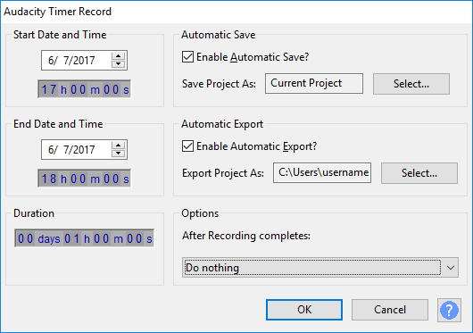
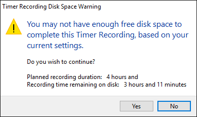

# New features in Audacity 2.1.3

**This page is an overview of the key new functionality that has been introduced in Audacity 2.1.3**

* Details of all the major changes since 2.1.2 can be found in [.](./ "mention").

### Transport improvements

#### [Pinned play/record head](http://manual.audacityteam.org/man/playing\_and\_recording.html#pinned)

We have implemented the long-standing and popular feature request of a fixed and centered play/record head (called the "pinned head"). When the pinned head is selected the waveform scrolls continuously past the fixed head while you are playing or recording.

The pinned head can be selected by using the new button at the left of the Timeline. By default this is the familiar green downwards-pointing triangle (like the playhead) and the default behavior is the old familiar scrolling play/record head. The pinned head can also be selected in Tracks Preferences.

When pinned playback or recording is chosen, the playhead displays as a green drawing-pin (as shown in the image below) and the recording head displays as a red drawing-pin.

<figure><figcaption>
Pinned playhead
</figcaption></figure>

Clicking the drawing-pin reverts to default unpinned playback and recording, and the button will change back to the green triangle.

#### [Scrubbing](http://manual.audacityteam.org/man/scrubbing\_and\_seeking.html)

For this release we have changed the way in which scrubbing works.

We have introduced a new [Scrub Ruler](http://manual.audacityteam.org/man/scrubbing\_and\_seeking.html#scrubbing) which is on by default and sits just under the [Timeline](http://manual.audacityteam.org/man/timeline.html). You can turn it on or off from the right-click dropdown menu of the Timeline.

If you hover the mouse over the Scrub Ruler you will see the Scrub widget's green left- and right-pointing arrows appear _(along with a tooltip if you continue to hover)_. Clicking anywhere in the Scrub Ruler, releasing the mouse button then moving the mouse left or right will start Scrubbing from there. Note that in this image the green scrub widget is to the right of the green triangle playhead, indicating that forwards scrubbing towards the pointer is taking place.

<figure><figcaption>
Scrub widget
</figcaption></figure>

To stop scrub play and set the cursor at the current playback position, just click the Stop button _(or its shortcut SPACE)_.


There is also a [Scrub Toolbar](http://manual.audacityteam.org/man/scrub\_toolbar.html) which is off by default, but you can enable it at **View > Toolbars**. This toolbar gives you button access to the scrubbing and seeking transport commands and facilitates turning the Scrub Bar on/off.


#### [Stop and Set Cursor](http://manual.audacityteam.org/man/transport\_menu.html#set)

The shortcut for [Play/Stop and Set Cursor](http://manual.audacityteam.org/man/transport\_menu.html#set) has changed from SHIFT + A to the simpler and easier to use X.

### [Timer Record](http://manual.audacityteam.org/man/timer\_record.html)

We have added some new features to improve Timer Record.

You can now specify optional actions on completion such as Save and/or Export, quit Audacity and, on Windows, shut down.

<figure><figcaption>
Timer Record additional options
</figcaption></figure>

Audacity will now warn you in advance if it calculates that you have insufficient disk space for the length of your scheduled recording.

<figure><figcaption>
Insufficient disk space for the scheduled recording
</figcaption></figure>

### Effects and Generators

#### [Stop and Do if paused](http://manual.audacityteam.org/man/transport\_toolbar.html#pause)

A big improvement you will notice is that all effects plus edits and other functionality can now be actioned from paused state - Audacity will stop the audio and do the action or open the dialog requested. This should remove a common cause of confusion for our users.

#### [Distortion Effect](http://manual.audacityteam.org/man/distortion.html)

We have introduced a new [**Distortion**](http://manual.audacityteam.org/man/distortion.html) effect _(which supersedes the "Leveller" and "Hard Limiter" effects found in earlier Audacity versions)_. Technically this effect is a [waveshaper](https://en.wikipedia.org/wiki/Waveshaper). The result of waveshaping is equivalent to applying non-linear amplification to the audio waveform. Preset _shaping functions_ are provided, each of which produces a different type of distortion. Presets are provided which suggest typical settings for a wide range of uses.

#### [Rhythm Track](http://manual.audacityteam.org/man/rhythm\_track.html)

The former Click Track generator has been updated and renamed to [**Rhythm Track**](http://manual.audacityteam.org/man/rhythm\_track.html) with improved sounds and a new "Swing amount" control for unequal beat duration.

#### [Sample Data Import](http://manual.audacityteam.org/man/sample\_data\_import.html)

We have added a new Generator for [**Sample Data Import**](http://manual.audacityteam.org/man/sample\_data\_import.html) which reads numeric values from a [plain ASCII text](https://en.wikipedia.org/wiki/Plain\_text) file and creates a [PCM](https://en.wikipedia.org/wiki/Pulse-code\_modulation) sample for each numeric value read.

### [Keyboard Shortcuts](http://manual.audacityteam.org/man/keyboard\_shortcut\_reference.html)

There are two new keyboard shortcuts to navigate between labels: ALT + RIGHT to Move to Next Label and ALT + LEFT to Move to Previous Label. Use these shortcuts to move the editing position to the label, without opening the label for editing. If audio is already playing, playback jumps to the label requested, which is useful if you have [split a recording into separate tracks](http://manual.audacityteam.org/man/splitting\_a\_recording\_into\_separate\_tracks.html) using labels.

These new shortcuts also let screen readers for the blind read the label's name and its order in the labels in that track, a feature lacking in Audacity until now. There are no corresponding menu entries or buttons for these shortcuts.

### New menu items

#### Edit Menu

There are two new commands to aid making selections:

* Use **Edit > Store Cursor Position** to store the position of the editing cursor (or when there is active audio, to store the position of the playback or recording cursor).
* Subsequently, use **Edit > Select > Cursor to Stored Cursor Position** to select from the editing cursor (or during active audio, from the position of the playback or recording cursor) to the stored cursor position.


In version 2.2.0 these commands were moved to the new [**Select Menu**](http://manual.audacityteam.org/man/select\_menu.html).


#### Tracks Menu

Another new menu item is **Tracks >Type to Create a Label (on/off)**. Previous Audacity already let you type to create a label in the focused label track, but this feature made it easy to accidentally create a label when you really wanted to use shortcuts to play or act on the audio. Uncheck this new menu item (or make the same change in **Tracks Preferences**) to avoid that risk.


In version 2.2.0 this command was moved to the **Edit > Labels** menu.


### [Audacity Tour Guide](http://manual.audacityteam.org/man/audacity\_tour\_guide.html)

We have added [**Audacity Tour Guide**](http://manual.audacityteam.org/man/audacity\_tour\_guide.html) to this Manual. It tells you about a few of the core Audacity features and about some of the more specialized features you might not know where to find.

### [New features in Audacity 2.1.3 - Appendix](new-features-in-audacity-2.1.3-appendix.md)

This page [new-features-in-audacity-2.1.3-appendix.md](new-features-in-audacity-2.1.3-appendix.md "mention") gives an overview of further new functionality that has been introduced in Audacity 2.1.3

### Links

[.](./ "mention") _- detailed release notes for this release of Audacity_
