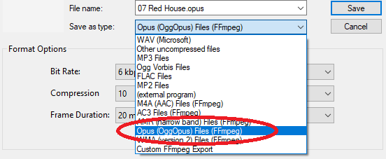

# New features in Audacity 2.4.0

This page is an overview of prominent new functionality that has been introduced in Audacity 2.4.0

* Details of all the major changes since 2.3.3 can be found in [.](./ "mention").

### Time Toolbar|Hitting the big Time

For this release the audio time position has been removed from the **Selection Toolbar** and created a new toolbar, the **Time Toolbar**. It is a read-only toolbar which displays the current audio position. The larger size of numbers makes it easy to read when, for example, you are recording an instrument you are playing and are further from the computer screen and keyboard than when directly editing the audio.

When Playing or Recording Time Toolbar dynamically shows the current playhead or recordhead position.

When Audacity is not Playing or Recording it will display either the current cursor position or the beginning of the current selection if present.

<figure><figcaption>
Time Toolbar showing the current playback position of 44 seconds
</figcaption></figure>

#### Features of Time Toolbar:

* Time Toolbar provides a larger display, _easily readable at a glance_, for the current audio position. It is a double-height toolbar with a default display of roughly 1.5x previous size.
* You can resize to full double height , shrink it smaller or just remove the toolbar if you don't need it. It can be redocked in various positions in either tooldock and can be floated if you wish
* The time display format can be changed independently of the Selection Toolbar's time format.
* As this Toolbar is read-only you cannot use it to reset the audio position, to do that you need to use the Selection Toolbar.

### Export and Import of settings in effects

Previously in Audacity you could only use the Export and Import buttons for VST and AU effects. This has now been extended to all effects that have a Manage button.

#### Import...

Imports presets which you have exported using the Export option (below) on this or other machines or which you have exported from other software that supports a compatible preset.

#### Export...

Exports an effect's current settings as presets _(in a text file)_ for use in Audacity on other users or machines via **Import** or for use in other software that supports import of a compatible preset.


Note carefully that this Export creates a single exported text file with just the current settings in the effect. It does _**NOT**_ export your entire set of User Presets.



**The equalization effects:** Filter Curve EQ **and** Graphic EQ**:**

In common with all other effects these now facilitate the import of pre-existing equalization curves for use in the effect.

* Many published curves, such as those on the [**Audacity Wiki**](https://wiki.audacityteam.org/wiki/78rpm\_playback\_curves#curves), and curves you may have exported in earlier versions of Audacity with the old Equalization effect, are in .XML format.
* Graphic EQ, like all other Audacity effects, expects the imports to be text files in .TXT format. To facilitate this we have provided a tool **EQ XML to TXT Converter**, this is not enabled by default but you can enable it with the **Plug-in Manager** after which it will be present in the Tools Menu.


### Multi-view

This is an _**advanced**_ feature for expert users enabling Spectrogram and Waveform displays of the same audio shown simultaneously in the same track.

Spectrograms and Waveforms have different strengths and weaknesses:

* Waveforms show you overall loudness best. You might see the danger of imminent clipping. Precision in cutting and splicing is also best performed in Waveform view.
* Spectrograms show you frequencies. In vocals, for example, you can see how vowel sounds change over time. The onset of new sounds, when another sound is playing, often shows up more clearly in Spectrograms.

Choose whichever one gives you the best information for the task in hand.

<figure><figcaption>
Example of a stereo audio track with a Multi-view split 50:50 Waveform/Spectrogram
</figcaption></figure>

To get a split Multi-view for a track select **Multi-view** from the track's **Track Control Panel** dropdown menu.

### Opus Export

**Opus** has been added as an export option to the **File > Export > Export Audio** and **File > Export > Export Multiple** commands.

It is accessed from those commands then choosing **Opus (OggOpus) Files (FFmpeg)** from the **Save as type** dropdown menu in the Export dialog:

<figure><figcaption>
<strong>Opus (OggOpus) Files (FFmpeg)</strong> option for exporting
</figcaption></figure>

This **Opus Export** replaces the previous "opus" export from the (**external program)** option in the Export dialogs, which never worked for "opus", always giving a failure error message.


Opus Export is only available on Windows and Linux for now - we aim to provide it on Mac in a future release - see [Bug #2381](https://bugzilla.audacityteam.org/show\_bug.cgi?id=2381).


### Changed behaviors for resizing and moving labels

The gestures for resizing and moving labels has been changed slightly in this release. This was done in fixing a couple of bugs that were found relating to label editing.

#### Point label

* You can **move a point label** by clicking and dragging its circle handle.
* You can **turn a point label into a region label** by clicking and dragging either of its chevron handles.


You can also **move a point label** by holding the Shift key down while clicking and dragging the circle or either of its chevron handles.

Using this shift-modified click\&drag with a point label avoids any risk of accidentally creating a region label.


#### Region label

* You can **change the length of a region label** by clicking and dragging its circle or either of its chevron handles.
* You can **move a region label** by holding the Shift key while clicking and dragging its circle or either of its chevron handles.
* In the case where two region labels meet you can **adjust the junction point** where they meet by clicking and dragging their shared circle handle.


There is now a slight visual cue to distinguish between a point label and a region label that is too short to display at the current zoom level.

The region never collapses down to a single line, rather there is always a line for each edge of the region resulting in a double line, slightly visibly thicker.


### Spectrograms now show Clip Boundaries

Spectrogram views have changed, they now show **Clip Boundaries**, the dark vertical lines in the image below.

<figure><figcaption>
<strong>Clip Boundaries</strong> in Spectrogram view
</figcaption></figure>

Formerly these clip boundaries were only shown on Waveform views.

This change also affects the new [Multi-view](new-features-in-audacity-2.4.0.md#multi-view) display.

### Selecting Waveform dB

This used to be accomplished with the TCP dropdown menu, it is now in the Waveform _Vertical Scale'_ context menu.

A right-click in the Vertical Scale will bring up a dropdown context menu enabling swapping between **Linear Waveform** _(default)_ and **Waveform dB** views.

<figure><figcaption>
Waveform dB option added to the  context menu
</figcaption></figure>

### Scrubbing using the keyboard

Two new shortcut commands have been added to facilitate scrubbing from the keyboard.

These are:

* I: Scrub Forwards
* U: Scrub Backwards

they are part of the Standard default set of keyboard shortcuts.

After pressing one of these scrubbing keys playback continues until the key is released. Playback starts from the cursor position or the start of a time selection if there is one. Scrubbing is not limited by any selection that may be present.

If one of the keyboard scrubbing keys is being held down, and the other keyboard scrubbing key is pressed scrubbing immediately changes direction, and does not stop when the original key is released.

The speed of playback is determined by the zoom level. If the zoom level is normal playback speed is one half of the normal playback speed. Zooming in (**Ctrl + 1**) halves the playback speed, zooming out (**Ctrl + 3**) doubles the playback speed. There are minimum and maximum playback speeds of one sixteenth and 3x, respectively.


If you want to use keyboard scrubbing at normal speed, just press **Ctrl + 2** to return to normal zoom level followed by **Ctrl + 3** to zoom out one level.


### Tracks Menu: Mute/Unmute|Muting and Umuting selected tracks

Two new commands have been added to the **Tracks** menu to enable you to simultaneously Mute or Unmute all the currently selected tracks.

* Tracks > Mute/Unmute > Mute Tracks
* Tracks > Mute/Unmute > Unmute Tracks

These operate on **all selected** audio tracks in the project, as if you had used the **Mute** buttons from the Track Control Panel on each selected track.

### Changes to Play/Record head pinning

The mechanism for toggling the Play and Record head from its default unpinned position to a pinned position on the Timeline has been changed. This was done to try to prevent users accidentally turning on pinned head and then not knowing how to revert to the default unpinned. When the head is pinned the head remains static and the waveforms will move as the audio is played or recorded.

Formerly a single click on the head icon at the left of the icon would toggle between the two modes. Now when you click on that icon a context menu is displayed:

<figure><figcaption>
Context menu for Play/Record head
</figcaption></figure>

From this menu you can choose to select or un-select **Pinned Play Head**.

The same context menu is available when you right-click in the Timeline - alternatively unpinned or pinned head can also be selected in **Transport > Transport Options**.


If you miss the availability of single click functionality to achieve toggling the head mode it is easy to set up a single-key custom shortcut.


### New effects and a new analyzer

#### Loudness Normalization

A new effect, "Loudness Normalization", has been added. As its name suggests, it normalizes for loudness.

Use Loudness Normalization to change the level of the audio _(normally reduce it to recommended limits)_.

It is based on EBU R 128 recommendations on limiting the loudness of audio signals.

<figure><figcaption>
<strong>Loudness Normalization</strong> effect
</figcaption></figure>


Why use **Loudness Normalization** rather than **Normalize** or **Amplify**?

*   Using **Loudness Normalization** rather than **Normalize** or **Amplify** helps you more easily set the required LUFS loudness target when normalizing.

    When preparing audio for television or radio programs, podcasts and some websites you may be subject to loudness restrictions on the audio. Loudness is usually measure in **LUFS** (Loudness Units Full Scale). The LUFS level restrictions can vary by application. For example, the level for television in the US is normally -24 LUFS, the EBU (European Broadcasting Union) recommends -23 LUFS. Out of all the standards this one is the most serious in that a television network can get its broadcast license revoked for a violation.
* Another use case is creating an equally loud playlist from different sources.


#### Measure RMS

A simple analyzer to measure the _**RMS**_ _(Root Mean Square)_ levels in a track.

<figure><figcaption>
<strong>Measure RMS</strong> analyzer
</figcaption></figure>

The example above is the measurement of a typical stereo track.

If you use this analyzer on a mono track you will just get a single figure shown.

#### Noise Gate

Another new effect has been added, "Noise Gate", which can be used to reduce the level of sound below a specified threshold level.

A noise gate is a kind of "dynamics processor" that allows audio above a specified threshold level to pass through unaffected (gate "open"), and stops or reduces sounds below the threshold level (gate "closed").

Noise Gates may be used to cut the level of residual noise between sections of a recording. This Noise Gate has a number of settings that allow it to be effective, unobtrusive and well suited to most types of audio.

<figure><figcaption>
<strong>Noise Gate</strong> effect options
</figcaption></figure>

#### Spectral Delete

A new effect has been added to the spectral editing effects.

The Spectral Delete effect acts on a spectral selection to delete a spectral selection from the audio.

<figure><figcaption>
A spectral selection, shown in Multi-view, after applying Spectral Delete, deleting the frequencies from 5 kHz to 7kHz
</figcaption></figure>

For this we have used a higher than default "Window Size" of 4096 in the spectrogram settings, because that shows the accuracy of the frequency cut much better.

The Spectral Selection Toolbar has been enabled and floated to aid and show the accurate selection range.

### Searching the Manual

For this release we have added a page to the Manual on **Searching the Manual**.

For various technical reasons we cannot provide a Search box/button for the Manual. So this new page provides some useful workarounds.

The page can readily be accessed from any Manual page you are on from the **Reference** section of the left-hand navigation bars.

<figure><figcaption>
Search option added to the manual
</figcaption></figure>

There is also an entry for it in the **Quick Help** section on the Manual's front page.

### Bug Fixes

Over 100 bugs have been fixed for this release, including over 50 priority 1 and priority 2 bugs.

Here is a small selection of some of the most important.

#### Key P1 bugs fixed

* P1 [2227](https://bugzilla.audacityteam.org/show\_bug.cgi?id=2227) - Mac: Audacity does not run properly on macOS 10.15 Catalina
* P1 [2237](https://bugzilla.audacityteam.org/show\_bug.cgi?id=2237) - Equalization effects have no Import or Export for curves
* P1 [2261](https://bugzilla.audacityteam.org/show\_bug.cgi?id=2261) - Graphic EQ sliders have no frequency labels
* P1 [2265](https://bugzilla.audacityteam.org/show\_bug.cgi?id=2265) - Track heights are reset to default on project re-opening
* P1 [2303](https://bugzilla.audacityteam.org/show\_bug.cgi?id=2303) - Playback does not start at the saved cursor position on reopening a saved project.
* P1 [2314](https://bugzilla.audacityteam.org/show\_bug.cgi?id=2314) - Zoom in fail when playing

#### Key P2 bugs fixed

* P2 [2062](https://bugzilla.audacityteam.org/show\_bug.cgi?id=2062) - Export as WAV does not remember the previously used setting
* P2 [2214](https://bugzilla.audacityteam.org/show\_bug.cgi?id=2214) - Rendering a single track unnecessarily moves the track to project bottom
* P2 [2218](https://bugzilla.audacityteam.org/show\_bug.cgi?id=2218) - Rendering a single track unnecessarily strips it of its properties
* P2 [2345](https://bugzilla.audacityteam.org/show\_bug.cgi?id=2345) - "Ignore blank space" Preference fails on Export Multiple based on "Tracks"
* P2 [2358](https://bugzilla.audacityteam.org/show\_bug.cgi?id=2358) - Loop Quick-Play does not scroll when playing
* P2 [2382](https://bugzilla.audacityteam.org/show\_bug.cgi?id=2382) - Timer record: if a labels are present recording starts at last label position - not cursor position

### Links

[.](./ "mention") _- detailed release notes for this release of Audacity_
