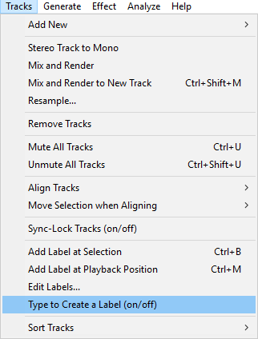
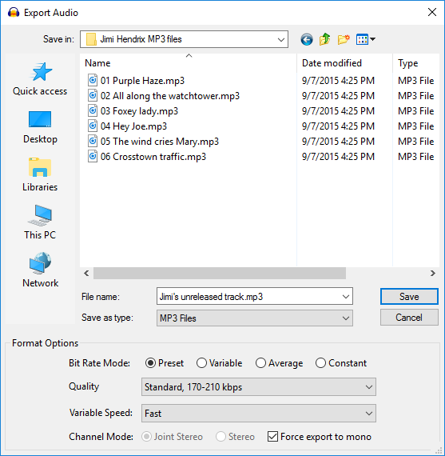
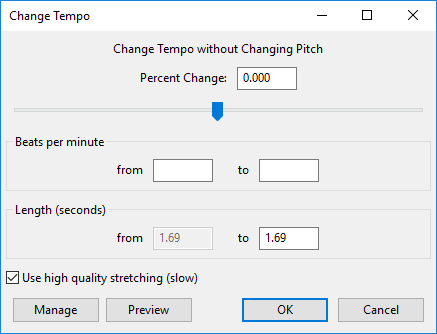

# New features in Audacity 2.1.3 - Appendix

### New shortcuts

#### Label Navigation

ALT + RIGHT to Move to Next Label and ALT + LEFT to Move to Previous Label. These shortcuts allow the name of the label and its order in the labels in that track to be read by screen readers. As well as moving the edit position, these shortcuts jump playback to the requested label.

### Type to Create a Label

There is a new **Tracks Menu** item "**Type to Create a Label (on/off)**" (turning it off prevents shortcuts accidentally creating labels in the focused label track). There is also an option in **Tracks Preferences** to make this setting.

<figure><figcaption>
New option (toggle) to create a label by typing
</figcaption></figure>

When enabled (default), if there is already a label track that has the yellow focus border, you do not need to use "Add Label at Selection" or its CTRL + B shortcut to create a new label. Just type your required label text to create a new label at the position of the editing cursor or selection region. If the label track does not have focus, use the UP or DOWN arrow keys on your keyboard to move focus into the label track.

If you turn this option off, typing never creates a label in the focused label track. This lets you use shortcuts (for example, transport shortcuts to play audio related to the editing cursor or selection) without accidentally creating an unwanted label. When you want to create a new label, use "Add Label at Selection" or CTRL + B or "Add Label at Playback Position" CTRL + M.

### Track naming

There are new **Recording Preferences** settings to control the naming of recorded tracks:

<figure><figcaption>
Recording Preferences to control the naming of newly recorded tracks
</figcaption></figure>

* **Use Custom Track Name:** Use this to replace Audacity's default name of _**Audio Track**_ with one of your own choosing.
* **Add Track Number:** Appends a track number to each new track name.
* **Add System Date:** Appends the date to each new track name, in year-month-day format.
* **Add System Time:** Appends the start time of the recording to each new track name, in hours-minutes-seconds format, 24-hour clock.

### Export

There is a new export option when exporting to MP3 "Force export to mono".

<figure><figcaption>
New <strong>Force export to mono</strong> for MP3 files
</figcaption></figure>

Enabling this checkbox always produces a mono (single channel) MP3 file, mixing down to mono if the Audacity content is stereo or would otherwise produce a stereo file. This is useful if stereo export is not required, because for variable or average bit rate or a Preset other than "Insane", the bit rate and hence the exported file size will be less than for stereo export, but with comparable quality to stereo. This is possible because fewer _**bits**_ are needed for mono encoding than stereo.

If you are exporting only one mono Audacity track and that track is panned to center, Audacity will still automatically export as mono without the need to enable the new option.

### SBSMS high quality option

Both Change Pitch and Change Tempo have a new option called "**Use high quality stretching (slow)**".

<figure><figcaption>
New high quality stretching option for Change Pitch and Change Tempo
</figcaption></figure>

If this checkbox is enabled, the same [SBSMS](http://sbsms.sourceforge.net/) high quality algorithm is used that is used in the **Sliding\_Time\_Scale\_-\_Pitch\_Shift|Sliding Time Scale / Pitch Shift** effect. Change Tempo will process much more slowly if this checkbox is enabled, but will retain the complete content. For small to moderate tempo changes, the resulting quality will usually be higher, especially with percussive music (such as piano music).

### Compressor

The "Ratio" setting in Compressor effect now lets you use higher precision. "Ratio" now allows a setting between 1.1 and 10, with 0.1 precision _(formerly, the minimum was 1.5, and the smallest increment was 0.5)_.

### Real Time Preview

The **Bass and Treble** effect now supports **Real-time preview** - effect settings can be changed while playing and listening to the result in real-time. As with other real-time preview effects, the Enable checkbox acts like a live "Bypass" control, so that unchecking the checkbox  Enable lets you hear the audio "dry" without the effect applied.

Bass and Treble also has a new checkbox item "Link Volume control to Tone controls". Enabling this automatically adjusts the Volume control for changes to Bass and Treble so as to lessen the change in the resulting output level.

### Scrolling on Mac

Audacity now supports Mac Trackpad gestures for two-finger horizontal scroll and pinch/expand to zoom the waveform in or out at the pointer position. Previously a modifier key had to be used to perform these actions on a Trackpad.

Horizontal scrolling and pinch/expand should also work on most touchpads on Windows machines, but you may need to apply this [horizontal scrolling modification](http://forum.tabletpcreview.com/threads/twofingerscroll-v1-0-7-update-two-finger-scrolling-done-right-more.38405/) or to install special drivers for your touchpad.

### Links

Back to: [new-features-in-audacity-2.1.3.md](new-features-in-audacity-2.1.3.md "mention")\
[.](./ "mention") _- detailed release notes for this release of Audacity_
