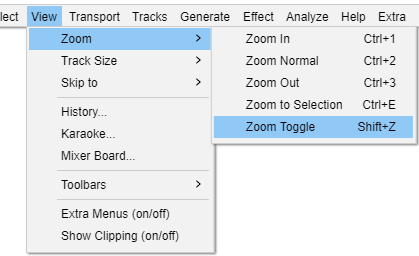
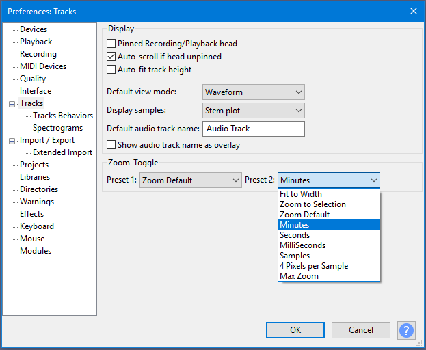
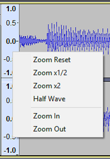

# New features in Audacity 2.2.2

**This page is an overview of the key new functionality that has been introduced in Audacity 2.2.2**

* Details of all the major changes since 2.2.1 can be found in [.](./ "mention").

### Dropout detection

**"Dropouts"** are small fragments of missing audio on recording. They can sometimes be caused by very slow processing, especially slow writing to disk or USB key, when writing data cannot keep up with the recording.

* We have added dropout detection for this release.


* You may have been experiencing dropouts and not noticing, _they are not discernible while recording only on playback_. So Audacity 2.2.2 could appear much worse than previous releases, when in actual fact Audacity is just alerting you to a problem that you previously would not have been aware of - or might have put down to a bad microphone or poor recording technique.
* Audacity makes its best effort to detect dropouts as they occur, but detection may be incomplete for some operating systems and audio hosts.



If you are certain that your recordings do not suffer from dropouts, you may wish to turn this new option "**off**".


Dropout detection is controlled from a setting in **Recording Preferences** called "**Detect dropouts**".

* When this setting is "**on**" _(default setting)_ Audacity will detect dropouts (brief gaps in the recording) and will insert zeroes into the recording to keep the other good parts synchronized. These silent spans will make the dropouts more obvious, but keep the duration of the recording correct.
  * Dropouts may be caused by a disk drive that cannot keep up with the recording. This can happen, for example, with a slow USB or network drive, or if antivirus software is slowing writing to disk, or if other activity on the computer is slowing the computer down.
* When recording stops, a Warning message box alerts the user and a label track, called "Dropouts", is added showing the lost parts, labeled with consecutive numbers.

<figure><figcaption>
Dropout detection warning message and Dropouts track added
</figcaption></figure>

### Improved Zooming

For this release we have improved the way zooming using your mouse wheel works and provided a new Zoom Toggle function.

* This is particularly for users who zoom in and out a lot, e.g. when using the **Repair** effect to do detailed work removing clicks in the audio.

#### Zooming with the mouse wheel

We have changed mouse wheel zooming so that the focus for the zoom is:

* With the mouse pointer outside the selection, the leftmost or rightmost edge of the current selection, _(if a selection exists)_.
* Mouse pointer position will be used as the zoom focus if the mouse position is inside the current selection, _(if a selection exists)_.
* If no selection is present, zoom focus is as it was before and is taken as the mouse pointer position.

#### Zoom Toggle

We have introduced a new command, **Zoom Toggle**, accessed by a new button or by (shortcut Shift + Z).

<figure><figcaption>
Edit Toolbar with Zoom Toggle button at the far right of the Toolbar
</figcaption></figure>


The extra button for Zoom Toggle won't show up until you reset toolbars, if you've upgraded from a previous version of Audacity which had the old toolbars. You can find reset toolbars in the view menu, View > Toolbars > Reset-Toolbars.


<figure><figcaption>
Zoom Toggle menu entry in the View menu
</figcaption></figure>


For Zoom Toggle, the keyboard shortcut, Shift + Z is a lot more convenient than using the menu. If you want to change Shift+Z to something else, use Keyboard Preferences.


Zoom Toggle toggles between two pre-defined zoom levels. These presets are user selectable in **Tracks Preferences**.

* Defaults are normal **Default Zoom** level and **4 Pixels per Sample** _(which shows a fraction of a second of audio as samples)_
* Either of the two presets can be changed in **Tracks Preferences** using the dropdown menus.

<figure><figcaption>
Tracks Preferences to change the two presets for Zoom - Toggle
</figcaption></figure>

**Tracks Preferences showing Zoom Toggle selection dropdown for Preset 2**

### Vertical Zooming changes

There have been some changes to Vertical Zooming.

#### Simple Vertical Zooming

* We have introduced a context menu for the **Vertical Scale**. This is activated by right-clicking in the Vertical Scale - see [Simple mode vertical zooming](https://alphamanual.audacityteam.org/man/Vertical\_Zooming#simple) for details.

<figure><figcaption>
Vertical Scale context menu with zoom options
</figcaption></figure>

#### Advanced Vertical Zooming

* Left-click, and drag, in the Vertical Scale remain available as a user-selectable option - see [Advanced mode vertical zooming](https://alphamanual.audacityteam.org/man/Vertical\_Zooming#advanced) for details.
* You can turn on advanced mode for vertical zooming from **Edit > Preferences > Tracks Behaviors** and selecting **Advanced Vertical Zooming**.

### Extra Menu

The **Extra** menu, created from consolidating **Ext-Bar** and **Ext-Command** menus that were introduced in the previous 2.2.1 release.

<figure><figcaption>
The new <strong>Extra</strong> menu
</figcaption></figure>

### Theme Tweaks

#### Hover Appearance

* In dark theme, the change in appearance of sliders when you hover over them is greater than before.
* In light and dark themes, buttons such as 'pause' and 'pin' now highlight when you hover over them and they are down. Previously there was no visible change.
  * The hover effect for buttons when they are up has been changed to work better in conjunction with this change.

#### Icon Appearance

* In dark theme the microphone and speaker icons are now brighter and not dulled as they were before.

### Easier access to changing key bindings for shortcuts

For menu commands that are enabled _(not grayed-out)_ if you hold the Shift key and click on the sub-menu item, instead of executing the command the **Keyboard Preferences** pop open at the chosen command. You can then change that _(or any other)_ shortcut binding.

### Language selection in Preferences

Interface Preferences has been upgraded so when selecting languages the proper spelling of these languages is shown with accented and special characters.

<figure><figcaption>
Language selection in Interface Preferences
</figcaption></figure>

### Upgraded Manual Index page

* The **Index** page in the Manual has been upgraded - so that now any item that can be clicked on/through in the front page imagemap now has a corresponding text entry in the index _(this is primarily as an aid to VI (Visually Impaired) users)_
* Additionally the Index has been divided into alphabetic sections to aid readability.

### Bug Fixes

* Multiple use of "Save As" to the existing open project can result in data corruption/loss
* Crash undoing during record, using Discard button of History window
* Exporting audio in compressed formats to device with insufficient space produces inconsistent/truncated results
* In Export Multiple, Cancel does not remove the file that is in progress when Cancel is chosen
* Unicode page encodings fixed ( ͡° ͜ʖ ͡°)
* Crash using SBSMS pitch change at low sample rate
* (Mac) Equalization: "Telephone" curve displays a flat line, no sound on Preview
* Toolbars: open undocked if previously not shown, unless Reset Toolbars first
* Analysis effects that create labels should give focus to label track
* Control value may be out of range when using FloatingPointValidator
* Analysis effects produce false indication that a label is open for editing
* Import Uncompressed File Dialog Incorrect Reference to Menu Item
* Wave Color not grayed out in TCP dropdown menu when in Spectrogram view
* Hover indication on note track channel toggle appears on all tracks (when they rerender)
* Installer has old logo for 2.2.1 and 2.2.0
* Un-muting with a single track unnecessarily activates the Solo button
* Applying chain to file should zoom-to-fit

### Links

[.](./ "mention") _- detailed release notes for this release of Audacity_
