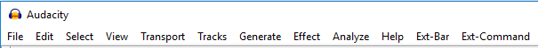
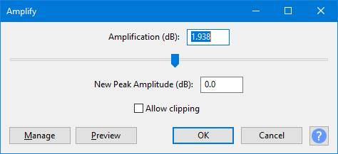
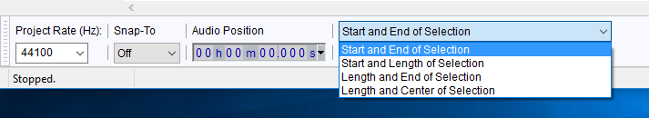

# New features in Audacity 2.2.0

**This page is an overview of the key new functionality that has been introduced in Audacity 2.2.0**

* Details of all the major changes since 2.1.3 can be found in [.](./ "mention").

### New Logo

The logo has been given a refresh, and now uses a sans-serif font and a flatter style.

<figure><figcaption>
New Audacity logo
</figcaption></figure>

### [Themes](http://manual.audacityteam.org/man/themes.html)

Audacity now comes supplied with four pre-configured, user-selectable, themes. This enables you to choose the look and feel you prefer for Audacity's interface. see the Themes page for details.

* **Light** theme: this is a light theme loosely based on the look and feel of earlier Audacity versions, but given a contemporary twist with more modern-looking buttons and icons.
* **Dark** theme: created by the [Dark Audacity project.](http://www.darkaudacity.com/) This is similar to the Light theme, with the same buttons and icons, but given a dark twist.
* **Classic** theme: The one you know and loved. This theme is a re-creation of the look and feel of earlier Audacity versions.
* **High Contrast** theme: some users with poor eyesight benefit from a high contrast that is 'eye-popping' for most people.

The theme to use can be chosen at **Edit > Preferences >** [**Interface**](http://manual.audacityteam.org/man/interface\_preferences.html)


In addition to the four pre-configured themes there is also a Custom theme.

By default the custom theme looks the same as Classic theme - but, if you have the right programming skills and tools, you can use this template to create your own theme. Instructions for how to do this may be found in the [Audacity Wiki](https://wiki.audacityteam.org/wiki/Theming\_HowTo).


### MIDI (and Allegro) Playback

Playback of MIDI (and Allegro) files imported into [Note Tracks](http://manual.audacityteam.org/man/note\_tracks.html) is now available. Please see the [Note Tracks](http://manual.audacityteam.org/man/note\_tracks.html) page for more details.

This should just work on Windows but for playback on Mac and Linux additional software may be required, see [this section](http://manual.audacityteam.org/man/playing\_and\_recording.html#midi) on the [Playing and Recording](http://manual.audacityteam.org/man/playing\_and\_recording.html) page.

But note that there will no use of the [Playback meter](http://manual.audacityteam.org/man/meter\_toolbar.html#playback) while Note tracks are played.

### Stem Plots

There is a new entry in the [Tracks Preferences](http://manual.audacityteam.org/man/tracks\_preferences.html) for **Display samples**. This setting changes how [Waveform](http://manual.audacityteam.org/man/audacity\_waveform.html) and [Waveform dB](http://manual.audacityteam.org/man/audacity\_waveform.html#db) views are displayed. It only affects the appearance of the waveform when you are so far zoomed in that you can see the individual sample dots. At lower zoom levels it makes no difference.

* **Stem plot:** This is the default setting which draws a vertical line from the track center line to the sample dot, giving a clearer impression of the relative amplitude of the samples. As seen in the images below, when zoomed out close to the minimum for a stem plot, the horizontal distance between sample dots may be more uneven than seen with the connect dots default.
* **Connect dots:** This is alternative setting yields a waveform where each sample dot is connected to the next sample by a line drawn between them.

<figure><figcaption>
Display samples alternatives
</figcaption></figure>


Uneven spacing is due to "aliasing", but zooming in further will equalize the spacing whether choosing Connect dots or Stem plot.


Uneven spacing is due to "aliasing", but zooming in further will equalize the spacing whether choosing Connect dots or Stem plot.

### Menu reorganization

We have made the Menus shorter and clearer than in previous Audacity versions. The menus have been simplified without losing functionality. The most commonly used functions are found in the top levels of the menus. The functions moved down into lower submenus are better organized.

This is not just a rearrangement. We also added new menu items to make the layout more logical. There are new menu items for exporting as MP3 or WAV. Previously you had to export audio, and then choose the format. You still can do that, but these new items are there for convenience.


One of the long standing bug-bears with Audacity is the distinction between ‘Save’ and ‘Export’. People expect to be able to open a WAV audio file, edit it in Audacity and then click save. That is not how Audacity works. Audacity needs audio in its own unique format to work on it. So Audacity converts when you 'Open' a WAV file and converts back when you 'Save'. In an attempt to make this clearer Audacity uses the word 'Import' for opening a file like WAV and 'Export' for converting and saving in a format like WAV. Open and Save are reserved for Audacity's own project format.

Now the ‘Export’ options are under the ‘Save Other’ menu item, where people trying to save audio as an MP3 or WAV file are more likely to find them.


### The Extended Menu bar

There are two new additional menus that are hidden by default. They can be turned on at **View >** [**Extra Menus (on/off)**](http://manual.audacityteam.org/man/view\_menu.html#extra\_menus\_onoff) or the **Interface** pane of **Edit >** [**Preferences**](http://manual.audacityteam.org/man/interface\_preferences.html).

These extra menus have many extra less frequently used commands. They are particularly useful to VI users, but normally-sighted users may find them useful too.

<figure><figcaption>
Image of the Extended Menu bar as it appears on Windows
</figcaption></figure>

_**Image of the Extended Menu bar as it appears on Windows**_

| Menu                                                                      | What you'll find there                                                                                                                                                                                                                                                                                                                                                                                                                                                                                        |
| ------------------------------------------------------------------------- | ------------------------------------------------------------------------------------------------------------------------------------------------------------------------------------------------------------------------------------------------------------------------------------------------------------------------------------------------------------------------------------------------------------------------------------------------------------------------------------------------------------- |
| [Ext-Bar](http://manual.audacityteam.org/man/ext\_bar\_menu.html)         | 
The Ext-Bar menu provides access to <a href="http://manual.audacityteam.org/man/toolbars_overview.html">Toolbar</a> operations that are not available in the default Audacity menus. These will be of most interest to visually impaired users or those who have difficulty using the mouse.

<a href="http://manual.audacityteam.org/man/keyboard_preferences.html">Shortcuts</a> can be assigned to these commands if required.
                                                                 |
| [Ext-Command](http://manual.audacityteam.org/man/ext\_command\_menu.html) | 
The Ext-Command menu provides access to extra commands for <a href="http://manual.audacityteam.org/man/audio_tracks.html#focus">track focus</a> and movement of the editing or playback cursor that are not available in the default Audacity menus. These will be of most interest to visually impaired users or those who have difficulty using the mouse.

<a href="http://manual.audacityteam.org/man/keyboard_preferences.html">Shortcuts</a> can be assigned to these commands if required.
 |


If you only require regular access to a small set of these commands you can set shortcuts for them and leave the extra menus hidden.


### Appended recording on the same track is now the default

From Audacity 2.2.0 onward the default recording mode has changed so that when you click the Record button  on [Transport Toolbar](http://manual.audacityteam.org/man/transport\_toolbar.html), or use the R, Audacity will record at the end of the currently selected (or only) track.

#### To record on a new track

If you hold the Shift key down the Record button in [Transport Toolbar](http://manual.audacityteam.org/man/transport\_toolbar.html) will temporarily change to . Then clicking on this modified Record button, or using the shortcut Shift + R will cause Audacity to create a new track and begin recording on that track from the current cursor position (or from the left edge of a region on the [Timeline](http://manual.audacityteam.org/man/timeline.html)).

### Help buttons

Many places in the user interface have had a help button ? added. Examples are all the Preferences dialog panes, all the Effects, Generators and Analyzers and some error messages.

Clicking on that button in the dialog will link you to the appropriate page in the Manual.

**Example:** the Amplify effect. Try clicking on the "**?**" at the bottom right of this image.

<figure><figcaption>
Help button on the Amplify effect window
</figcaption></figure>

### Standard and Full shortcut sets

For Audacity 2.2.0 we have reduced the number of preset shortcuts in the application to a "[**Standard**](http://manual.audacityteam.org/man/keyboard\_shortcut\_reference.html)" set. We did this to simplify the set of shortcuts somewhat and to provide greater flexibility for users who want to set their own custom shortcuts.

You can choose to revert to the full set of shortcuts that were in 2.1.3 and earlier by selecting "**Full**" from the dropdown menu accessed from the **Defaults** button in the [Keyboard Preferences](http://manual.audacityteam.org/man/keyboard\_preferences.html) dialog.

You can use the **Defaults** button to switch between the two provided default sets of shortcuts at any time.

<figure><figcaption>
Standard and Full shortcuts sets
</figcaption></figure>

See [Commands and Keyboard Shortcut Reference](http://manual.audacityteam.org/man/keyboard\_shortcut\_reference.html) for more details.

### Selection Toolbar improvements

There are now four available settings in the Selection and Audio Position Boxes in [Selection Toolbar](http://manual.audacityteam.org/man/selection\_toolbar.html) for the manner in which the details of your selection are displayed:

* **Start and End of selection**: the start time and the end time of your selection _(default setting)_
* **Start and Length of selection**: the start time and the length of your selection
* **Length and End of selection**: the length and the end time of your selection
* **Length and Center of selection**: the length and the time at the center of your selection

<figure><figcaption>
Selection and audio position options
</figcaption></figure>

### New commands for using clips via the keyboard

New commands, all of which interact with the clips on the focused track. As yet, there are no default shortcuts:

1. Transport > Cursor to > [Previous clip boundary](http://manual.audacityteam.org/man/transport\_menu\_cursor\_to.html#previous\_clip\_boundary)
2. Transport > Cursor to > [Next clip boundary](http://manual.audacityteam.org/man/transport\_menu\_cursor\_to.html#next\_clip\_boundary)
3. Select > Clip Boundaries > [Previous clip boundary to cursor](http://manual.audacityteam.org/man/select\_menu\_clip\_boundaries.html#previous\_clip\_boundary\_to\_cursor)
4. Select > Clip Boundaries > [Cursor to next clip boundary](http://manual.audacityteam.org/man/transport\_menu\_cursor\_to.html#next\_clip\_boundary)
5. Select > Clip Boundaries > [Previous clip](http://manual.audacityteam.org/man/select\_menu\_clip\_boundaries.html#previous\_clip)
6. Select > Clip Boundaries > [Next clip](http://manual.audacityteam.org/man/select\_menu\_clip\_boundaries.html#next\_clip)


There are also two new commands ([Clip Left](http://manual.audacityteam.org/man/ext\_command\_menu\_cursor.html#clip\_left) and [Clip Right](http://manual.audacityteam.org/man/ext\_command\_menu\_cursor.html#clip\_tight)) for moving clips, which are available in the [extended menus](broken-reference) added in this release.

Note that these extended menus are _**not**_ turned on by default, to turn them on please see [Menu Reference](http://manual.audacityteam.org/man/menu\_reference.html) for how to reveal the extended menus.


### Running out of disk space

We have now provided an error trap for situations where you are running out of available disk space.

You will now see the error message: "**Audacity failed to write to a file in \<device>**"

This is particularly useful when recording as Audacity will stop recording when the error is trapped, preserving your recording up to that point.

### [Additional new features](broken-reference)

This page [**New features in Audacity 2.2.0 - appendix**](new-features-in-audacity-2.2.0-appendix.md) gives an overview of further new functionality that has been introduced in this release of Audacity.

### Links

[.](./ "mention") _- detailed release notes for this release of Audacity_
