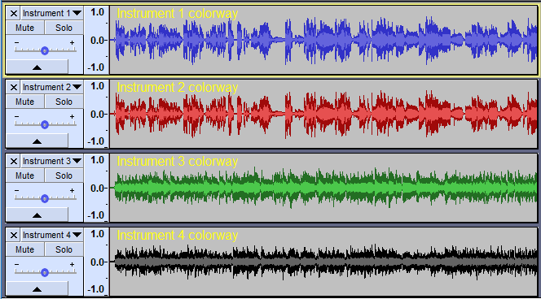

# New features in Audacity 2.2.1

**This page is an overview of the key new functionality that has been introduced in Audacity 2.2.1**

* Details of all the major changes since 2.2.0 can be found in [.](./ "mention").
* 2.2.1 is a very light release, basically a maintenance release, [see below](broken-reference) with one new exciting feature added. Plus we wanted to experiment with shorter release cycles.

### Waveform colorways

You can optionally change the colorway of the waveforms displayed in your project. The setting is per track and not per project so you can have multiple colorways in the same project as in the image below.

Four colorways are available with the color selection made from the [dropdown menu](http://manual.audacityteam.org/man/audio\_track\_dropdown\_menu.html) in the track's [Track Control Panel](http://manual.audacityteam.org/man/track\_control\_panel\_and\_vertical\_scale.html).

<figure><figcaption>
Waveform colorways
</figcaption></figure>

### "Save Other" reverts to "Export" in the File menu

When we made the menu changes for 2.2.0 we introduced an entry into the File menu called "Save Other" which led to a sub-menu for exporting various audio formats.

Many users were confused by this change and found it hard to find where they could export audio from. So for 2.2.1 we have changed that menu entry to be **File > Export**.

<figure><figcaption>
<strong>File > Export</strong> submenu
</figcaption></figure>

### Bug Fixes

Release 2.2.1 is mainly a maintenance release. Soon after the release of 2.2.0 we discovered some problematical bugs in Audacity:

* [Bug #1767](http://bugzilla.audacityteam.org/show\_bug.cgi?id=1767) - Opening a second project from Mac's Finder produces a second inaccessible instance of Audacity
* [Bug #1770](http://bugzilla.audacityteam.org/show\_bug.cgi?id=1770) - Crash applying certain chain files
* [Bug #1783](http://bugzilla.audacityteam.org/show\_bug.cgi?id=1783) - Preview fails when selection extends before zero
* [Bug #1787](https://bugzilla.audacityteam.org/show\_bug.cgi?id=1787) - Auto-scroll stopped working in 2.2.0
* [Bug #1765](http://bugzilla.audacityteam.org/show\_bug.cgi?id=1765) - Using **File > Open** to import audio gives wrong zoom level and no scroll bar slider

### Links

[.](./ "mention") _- detailed release notes for this release of Audacity_
