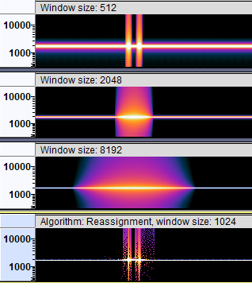

# Spectral analysis

## Spectrogram View

Each track in Audacity can be viewed in a Spectrogram view:

To access it, click on the **track menu dropdown** and select **Spectrogram.**

The track menu also features Spectrogram settings, where you can tweak the scale, the colors, the used algorithms and the window size.


**Tip:** To view the waveform and the spectrogram at the same time, choose **Multi-view** instead.


### Increasing Accuracy in Spectrogram View

You may notice that the spectrogram is somewhat blurry usually, where even if you have a precise frequency, the spectrogram makes it look like a whole range of frequencies is being played. This is an inherent mathematical tradeoff related to the window size:

Depending on what you're after, you can change the window size to fit your analysis: Smaller window sizes benefit time resolution, larger window sizes benefit frequency resolution.


**Tip:** If you change the algorithm from **Frequencies** to **Reassignment**, Audacity will attempt to sharpen both time and frequency resolution using the method of reassignment. This works best for signals that are separable in time and frequency with respect to the analysis window.


You can change both the window size and the algorithm in the spectrogram settings found in the Track Menu dropdown.&#x20;

### Zooming in on specific frequencies

You can zoom vertically in Spectrogram View by **right-clicking the frequency scale**.

Additionally, while hovering over the frequency scale, you can&#x20;

* Ctrl+Scroll to zoom in/out on the frequency scale and
* Shift+Scroll to scroll up/down while staying on the same zoom level.&#x20;

## Plot Spectrum

To use Plot Spectrum,&#x20;

1. **select** the audio you're interested in analyzing
2. go to **Analyze -> Plot Spectrum**.

### Options

#### Algorithm

* **Spectrum** (default) \
  Plots the fast Fourier Transform (**FFT**) of the data, with the FFT window size being determined by the **Size** dropdown. The amplitudes are normalized such that a 0 dB sine (pure tone) will be (approximately) 0 dB on the graph.
* **Autocorrelation**\
  These options measure to what extent the sound repeats itself. \
  This is done by taking two copies of the audio, and moving one forward by one sample. The two copies are then multiplied together, and all the values added up. This is repeated for two samples difference and so on, up to the number of samples in the **size** option. This gives a small result if the waveform is random (for example, noise) and a large result if it is repetitive (like a musical note). By looking at the peaks in the plot, the key frequencies present can be determined even if there is a lot of noise.
* **Cepstrum**\
  The cepstrum of an audio signal is related to the spectrum, but presents the rate of change in the different spectrum bands. It's particularly useful for properties of vocal tracks and is used, for example, in software to identify speakers by their voice characteristics.

#### Function

Function offers choices like Rectangular, Hann, Hamming and others. We suggest you use the default Hann for most situations.&#x20;

Details

The fundamental principle at work here is that the way we observe our data changes what we see. The "true spectrum" of your project would be computed over the entire project and would provide very detailed frequency resolution but essentially no time resolution at all. In other words, this "true spectrum" would offer an average frequency distribution over the entire project. If we select a short interval of audio, the short-time spectrum has frequency resolution limited by the observation window time AND the result is affected by the spectrum of the window itself. For general audio analysis, the Rectangular window is least desirable, and the other options offer slightly different effects

### Exporting a spectrum for further analysis

Click the **Export...** button to export the current view as a tab-separated value text file.&#x20;

## Analyzer Plugins

Audacity supports the **Vamp** plugin format among others. Many of them can be found in the [Vamp Plugin Pack](http://127.0.0.1:5000/s/klCVENFte0GRy5IqVz0W/realtime-effects/plugin-suites#vamp-plugin-pack).&#x20;


[Audacity Plugins](http://127.0.0.1:5000/o/-MhmG2mhIIHTtQPuHV\_k/s/klCVENFte0GRy5IqVz0W/)

