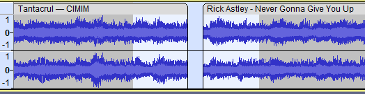

# Making crossfades

## Crossfading Clips

If you have two clips in one track you'd like to crossfade, you can use **Crossfade Clips** effect. To use it:

1. Have two clips in one track.
2.  Select the region you'd like to apply the crossfade to. Try to select roughly the same amount of time in both clips.

    \
    **Note:** Any empty space between the clips will be automatically removed and ignored in the crossfade.&#x20;
3. Use **Effects > Crossfade Clips** to crossfade the clips.&#x20;

## Crossfading between Tracks

To crossfade between tracks, use the following steps:&#x20;

1.  Position the clips on the tracks so that they overlap in the range you want to crossfade:

    
2. Select the audio in the first clip in the overlapping region and choose **Effects > Fade Out**
3. Select the audio in the second clip in the overlapping region and choose **Effects > Fade In**
