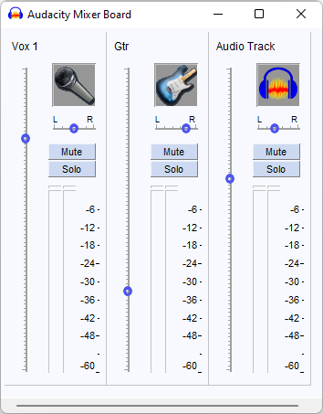

# Mixing and panning tracks

## Using the Track Controls

You can adjust volume and panning per track on the left-hand side of any track:


**Note:** If you collapse a track or make it vertically smaller, Audacity will hide the pan and volume sliders from view. To see them again, expand the track by dragging down on it's lower edge.


## Using the Mixer Board

You can access the Mixer Board via **View > Mixer Board**.

This shows all track controls side-by-side, with a volume slider on the left per track, as well as per-track volume meters.&#x20;

By default, the icon for each track is the Audacity logo, but it can be changed if the track name contains the following keywords:



* **acoustic piano, acoustic pno** = acoustic piano
* **back vocal, back vox, bg** = backing vocal
* **electric piano, electric pno, key** = electronic keyboard
* **loop** = loop track
* **sax** = saxophone
* **synth** = synthesizer
* **trumpet, horn** = generic brass instrument
* **turntable** = record player
* **vibraphone, vibes** = vibraphone
* **vocal, vox** = lead vocal



* **acoustic guitar, acoustic gtr** = acoustic guitar
* **electric bass, bass, bs** = electric bass guitar
* **electric guitar, guitar, gtr** = (standard) electric guitar
* **string, violin, cello** = generic stringed instrument

****



* **clap** = handclaps
* **drums, dr** = drum kit
* **kick** = kick drum
* **perc** = percussion
* **snare** = snare drum
* **tambourine, tambo** = tambourine



## Rendering the mix

Once you have your changes to mixing, panning and other real-time effects final and want to apply them onto the waveform itself, you can render the mix using **Tracks > Mix > Mix and Render**. This replaces all selected tracks with the mix. If you have used many tracks and real time effects, this may considerably improve performance.&#x20;


**Caution:** When rendering, all tracks are added onto each other, which may cause clipping. If this happens, undo the mix and lower the volume for all of your tracks.&#x20;



**Best Practice:** If you have a several stereo tracks, but don't need a stereo-effect for them (ie. any left/right panning), consider mixing down to mono using **Tracks > Mix > Mix Stereo Down to Mono**. Exporting a mono track to a lossy format (like MP3) will let you have a higher quality at the same bitrate, or let you use a lower bitrate (and thus lower file size) at the same bitrate.

