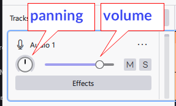

# Mixing and panning tracks

## Using the Track Controls

You can adjust volume and panning per track on the left-hand side of any track:


**Note:** If you collapse a track or make it vertically smaller, Audacity will hide the pan and volume sliders from view. To see them again, expand the track by dragging down on it's lower edge.

