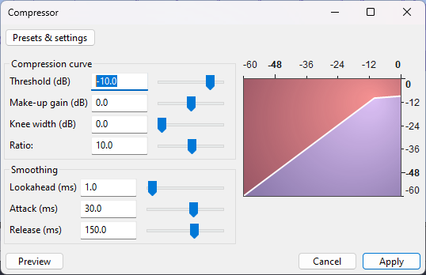
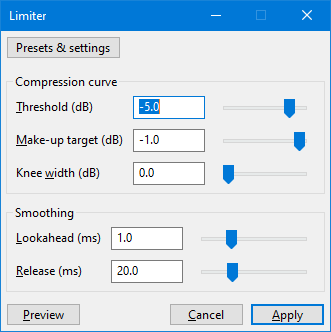

# 🆕 Reducing dynamic range (Compressor / Limiter)

A high [dynamic range](https://en.wikipedia.org/wiki/Dynamic\_range\_compression) can lead to quiet parts of a track being too quiet compared to its loud parts, causing the listener to constantly adjust the volume to keep things at an acceptable level. Audacity has several tools to help reduce the dynamic range and increase the loudness of a track.

## Compressor

<figure><figcaption>
Audacity's compressor
</figcaption></figure>

This effect can be found in **Effect -> Volume and Compression -> Compressor.**

The compressor can be used to reduce the dynamic range by a certain ratio for all sounds that exceed the threshold. Doing so will make the resulting audio quieter, so you need to add make-up gain to make up for that - or, alternatively, normalize your track in a second step. The knee width and smoothing parameters are there to reduce distortion. [More information can be found in the manual](https://manual.audacityteam.org/man/compressor.html).&#x20;


**Best practices**:&#x20;

* To get started, try a **factory preset** from the **Presets & settings** button. This effect comes with useful presets for a variety of content.
* Use this effect as a [master effect or realtime effect](using-realtime-effects.md) to see a graph of it working in realtime.&#x20;


## Limiter

<figure><figcaption>
Audacity's limiter
</figcaption></figure>

A limiter is effectively identical to a compressor, with the difference that it's much harsher: While a compressor uses a low ratio and may let a sound exceed the line drawn on the curve temporarily, a limiter does not allow any sound to exceed the threshold.&#x20;


**Best practices**:

* To get started, try a **factory preset** from the **Presets & settings** button. This effect comes with useful presets for a variety of content.
* Use this effect as a [master effect](using-realtime-effects.md) to see a graph of it working in realtime, and to prevent your project from clipping.&#x20;

