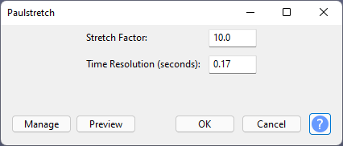

# 🆕 Speeding up and slowing down audio

## Changing speed while preserving pitch

In Audacity 3.4 and onwards, holding `Alt` (macOS: `Option`) while hovering over the edge of a clip shows a clock cursor (shown below). Once it appears, dragging the edge inwards or outwards lets you change the speed of a clip. This action is repeatable as many times as you like.

<figure><figcaption>
Example of a clip with a time-stretch cursor
</figcaption></figure>

To change the speed to precise values, right-click the clip header and select "Change Speed". This will open a dialog in which you can type in a number.

Additionally, if you want to render the stretching, that option is in the same right-click menu.

<figure><figcaption>
The speed-related
</figcaption></figure>

## Dynamically changing speed and pitch over time

You can change the speed of an entire project over time using Time Tracks. To add one, go to **Tracks > Add New > Time Track**.&#x20;

Then click on the blue line and drag it upwards or downwards to change the speed at that time. Every time you click, a new control point is added, allowing you to change the speed over time


**Note:** A time track always affects the entire project. Therefore, you can only have one time track per project.


## Changing speed and pitch of a clip

To change speed and pitch at the same time, use **Effect > Pitch and Tempo > Change Speed and Pitch**.

Unlike [Change Tempo](speeding-up-and-slowing-down-audio.md#using-the-change-tempo-and-paulstretch-effects), the Change Speed and Pitch effect keeps the waveform intact, so you can use this method repeatedly without any major loss in quality.&#x20;

## Using the Change Tempo and Paulstretch effects


**Caution:** The Change Tempo and Paulstretch effects cause permanent artefacts in your audio. It is advised to use the non-destructive methods described above to achieve the best quality.


To change the speed while preserving the pitch, select the audio you want to apply the effect on and go to **Effect -> Pitch and Tempo -> Change Tempo**

Drag the slider or enter some numbers to change how much you want to speed up or slow down your audio. The controls are linked, so you just need to change the value you care about, the rest will update accordingly.&#x20;

For extreme slowdowns (10x slower to thousands of times slower), you may want to use **Effect -> Pitch and Tempo -> Paulstretch** instead.&#x20;


**Note:** Paulstretch is only capable of slowing down, so the stretch factor relates to how many times you want to slow down your audio.&#x20;

The time resolution decides on whether the algorithm will focus on frequencies and pitch at the expense of rhythm (high time resolution), or whether it will focus on rhythm at the expense of pitch (low time resolution). Generally. 0.25 is a good compromise for most music


## Changing playback speed

If you want to preview your audio at a faster or slower rate than normal, but without affecting the final product, you can use the **Play-at-Speed toolbar** .png>)

To use it, drag the slider to the desired speed (between 0.01x and 3x) and then click the small play button next to it to playback your audio at that speed. You can use the normal stop and pause controls to stop/pause playback.&#x20;
