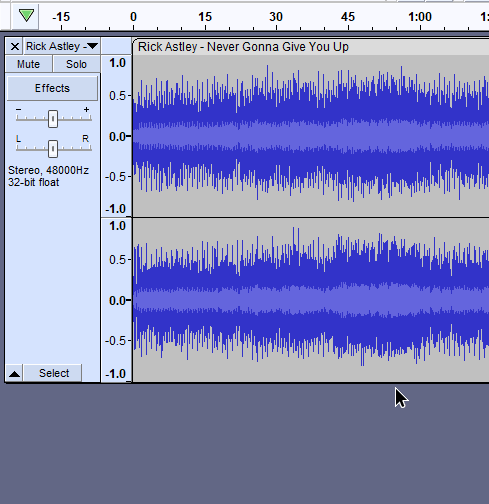

# 🆕 Using realtime effects

## Downloading & installing realtime effects

While Audacity doesn't yet ship with realtime effects, you can download plugins for it. Currently supported plugin formats are **Audio Units** (macOS only), **VST3**, **LV2**, and **LADSPA**. We have collected some plugins which we know to work on [plugins.audacityteam.org](https://app.gitbook.com/o/-MhmG2mhIIHTtQPuHV\_k/s/klCVENFte0GRy5IqVz0W/) but you can find many more across the web. Once you install the plugins, they should be detected by Audacity once you restart it, if not, see the [installation instructions](../basics/customizing-audacity/installing-plugins.md).&#x20;

## Adding effects to a track

<figure><figcaption></figcaption></figure>

You can add realtime effects using the following steps:

1. Click the **Effects** button in the track or press `e`
2. Click **Add effect** and choose an available effect from the list.


**Note:** Realtime effects always apply to an entire track. Since they're calculated realtime, they won't change the source waveform.&#x20;


## Changing effect settings

<figure><figcaption></figcaption></figure>

You can change the effect settings by clicking on the effect's name. This will open a settings window, often with a graphical interface which looks nothing like Audacity itself. You still can interact with the main Audacity window while the effect settings are open.

## Bypassing an effect

<figure><figcaption></figcaption></figure>

You can press the blue power button next to an effect (or the entire effects stack) to bypass it, causing it to be not applied to your audio.&#x20;


**Tip:** If you want to completely remove an effect from the stack, **press the triangle** next to the effect name and select "**No Effect**".&#x20;


## Applying an effect stack to the waveform

It generally is not necessary to apply the effect stack. The stack is automatically applied when **** [**exporting the audio**](../basics/saving-and-exporting-projects.md#exporting-audio).&#x20;

That siad, you can apply the effect stack to the waveform by first selecting the track and then going to **Tracks > Mix > Mix and Render**.&#x20;


**Caution:** When selecting several tracks at once, the Mix and Render option will mix all tracks together.

