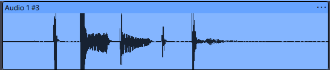
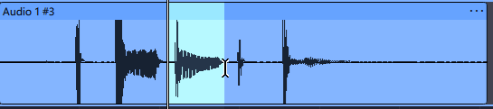
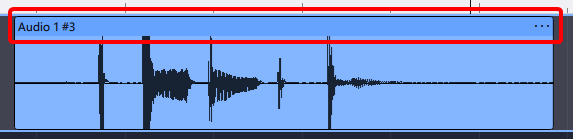
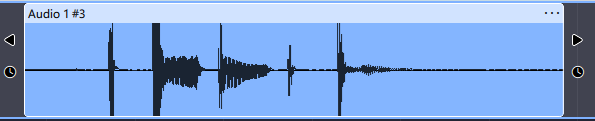

# Editing audio

## Importing a file

To start editing, you need some sort of sound to edit. You can either [record some sound](recording-your-voice-and-microphone/), or import an existing sound file (for example, an MP3 or WAV) by dragging & dropping it into the project window. You can also import files via the **File > Import** menus.


**Note:** To import proprietary file formats such as M4A or WMA, you need to [install FFMPEG](installing-ffmpeg.md) first.


Once you have imported a file, you will see a waveform of your sound:

This waveform is a visual representation of the song. The larger the dark "blob" is, the louder the section. Lines standing alone ("spikes") indicate sudden and short loud sections such as clicks, snaps, claps and drum hits. With a bit of practice, you can use the waveform to quickly find your way around an audio file.

## Removing sections of a song

To remove a section of an audio file, first select the section by **clicking and dragging** in the waveform.


**Hint**: You can zoom in using the by scrolling while holding the Ctrl key ( `Ctrl+Scroll`, macOS: `Cmd+Scroll`) to precisely adjust the beginning and end of the selection.


Once you have a selection, press `Delete` or `Backspace` to delete it.

## Moving sections of audio (clips)

Audacity supports clips, which are pieces of audio inside the project which can be moved independently. Any audio you record or import already exists as a clip.&#x20;

You can **click + drag** on the clip header bar to move a clip around.


**Note**: You can move a clip on top of another clip, into other tracks, or into the empty space below the tracks to create a new track.


## Splitting up clips

To split a clip into two independent clips, use the following steps:

1. Click on the **split tool** icon (scissors), or press `S`. This will cause any subsequent clicks to split the clip.
2. **Click** into a clip to split it.&#x20;

<figure><figcaption></figcaption></figure>


**Note:** You can also Click+drag across the waveform to split out a section.


## Resizing and trimming clips

To trim a clip, first select it by clicking into its header bar. This will cause some icons ("handles") to appear next to the clip.

Once you see them, **click and drag** with the upper set of icons to trim the clip to it's desired length.


**Note:** Trimming is a non-destructive operation. You can un-trim a clip at any time. If you have created your clip by [splitting up](audacity-editing.md#splitting-up-clips) a larger clip, you can even un-trim the current clip until it's at the length of the old clip. If you want to permanently remove the trimmed data, you can copy the clip to another project, choose **Selected audio only** when pasting, and move it back.


## Speeding up and slowing down clips

Just like trimming, speeding up and slowing down clips is done with handles next to the clip. To summon them, first click into the header bar to select it.&#x20;

<figure><figcaption></figcaption></figure>

Then, click and drag on the lower set of icons (the clocks) to speed it up or slow it down.&#x20;


Note: A sped-up or slowed down clip will have a little indicator in the top right corner. \
 (1) (1) (1) (1).png>)\
You can click on it to access advanced options (such as optimizing the stretching algorithm for voice), or to enter an exact number.


## Changing pitch of a clip

To change the pitch of a clip, right-click it, or click on the three-dot menu. Then select "Open pitch and speed dialog".&#x20;

<figure><figcaption></figcaption></figure>

In the dialog that opens, you then can change the pitch using the semitones and cents boxes.&#x20;


Best practice: When changing the pitch of a clip which involves the human voice, such as spoken word content or singing, make sure to check the "optimize for voice" tickbox. This will preserve formants and prevent the voice from sounding like a chipmunk.&#x20;

