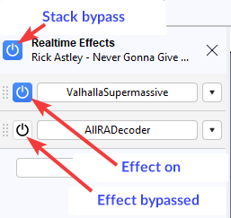

# Effect Presets

When you select an effect to apply to your audio (for example **Effect > Noise Removal & Repair > Noise Gate...**) Audacity will show you the effect settings window where you can change the different values according to your needs.

<figure><figcaption>
<strong>Noise Gate</strong> effect default settings
</figcaption></figure>

After you find the settings that best suit your needs you can use the **Presets & settings** button to save your settings for future use:

* Click the **Presets & settings** button and select **Save preset...**

<figure><figcaption>
Type a name and press <strong>OK</strong> to save your preset
</figcaption></figure>

* After saving your presets you can recall them the next time you need to apply the same effect.  Click the **Presets & settings** button, select **User Presets...** and select the name of the previously save presets:

<figure><figcaption>
To recall a previously saved preset click <strong>Presets &#x26; settings ></strong> 
</figcaption></figure>


To restore the factory default settings select **Presets & settings > Factory Presets > Defaults**

