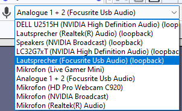

# Recording Desktop Audio

## 1. Select the loopback device



1.  In the device toolbar, select WASAPI.&#x20;

    .png>)
2. Select the output you want to use (the device you're using to listen) as the input. It will be marked with a (loopback) after it's name. \
   


When using the (default) MME device, you may find a virtual microphone called _Stereo Mix_, _What you hear_ or similar in it. This also will record your desktop audio.&#x20;




On macOS, you can use Soundflower to record desktop audio.

[https://github.com/mattingalls/Soundflower/releases/](https://github.com/mattingalls/Soundflower/releases/)&#x20;


Caution: Soundflower is not compatible with Apple Silicon-based machines




When using PulseAudio (default for Ubuntu, Linux Mint, and others):&#x20;

1. Install PulseAudio Volume Control (pavucontrol). This should be in your repository already.
2.  Set the audio host to ALSA, the recording device to pulse.

    If your system uses Pulse by default, the pulse device may be called default.&#x20;
3. Enable the recording meter by selecting "Click to start monitoring".  (1).png>)
4. Open PulseAudio Volume Control and choose the "Recording" tab.
5. In the "Capture from" dropdown, select the "Monitor" option of the playback device used by the application you want to record from
6. Launch the application that you wish to record and begin playback.
7. In the "Recording" tab of PulseAudio Volume Control, drag the volume sliders so that the recording level in Audacity's Recording Meter is to left of 0 dB (-6 dB is a good level to aim for).



## 2. Check if everything is set up correctly

Recording the desktop audio will record all desktop audio, including notification-pings, games, and Audacity itself (for example, other tracks in the timeline if you're using overdub) . So unless you specifically want these noises, make sure to turn them off.


**DON'T use software playthrough** when recording desktop audio. Make sure it's off in the menu: Transport > Transport Options > Software playthrough (on/off) - The :heavy\_check\_mark:checkmark next to it must be turned off. You can turn off overdub here as well.&#x20;


## 3. Record&#x20;

Hit the record button to record your desktop audio.&#x20;


**Note:** Using WASAPI, Audacity will only record when sound is playing and automatically pause the recording when the desktop audio sound stops. You can circumvent this by having adding a second, empty track to your project via Tracks > Add New... > Stereo Track

