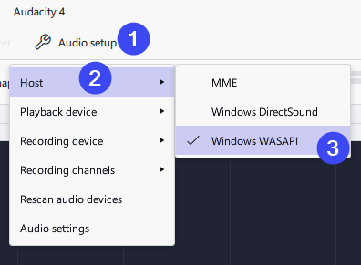
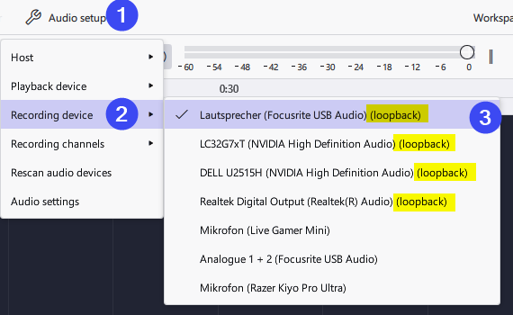

# Recording desktop audio

## 1. Select the loopback device



* Click on **Audio Setup** and ensure **Windows WASAPI** is set as the Host.

<figure><figcaption>
Select <strong>Windows WASAPI in Audio Setup > Host</strong>
</figcaption></figure>

* Select the output you want to use (the device you're using to listen) as the recording device. It will be marked with a (loopback) after it's name.

<figure><figcaption>
Select the <strong>loopback</strong> option for the device you want to record audio from.
</figcaption></figure>


Some sound cards also contain a loopback option called _Stereo Mix_, _What you hear_ or similar. This also will record your desktop audio.





**Note:** MacOS does not have built-in desktop audio recording capabilities. You'll need to download Soundflower to record desktop audio.


#### Soundflower


**Caution:** Soundflower is not compatible with Apple Silicon-based machines ("M1", "M2", ...)


1. Download Soundflower from [https://github.com/mattingalls/Soundflower/releases/](https://github.com/mattingalls/Soundflower/releases/) and follow the instructions provided there to install it.
2. Open the **Audio MIDI Setup** app (found in `/Applications/Utilities`).
3. Press the **+** button in the bottom left corner and select "**Create Multi-Output Device**".
4. In the panel that appears to the right, select **Built-in Output** and **Soundflower (2ch)**.
5. Press the gear button in the bottom left and select "use this device for sound output".\
   **Note:** If you don't set an option, you won't hear anything after completing the following steps.
6. Start Audacity
7. Click the **Audio Setup** button and set **Soundflower (2ch)** as the recording device.



When using PulseAudio (default for Ubuntu, Linux Mint, and others):

1. Install PulseAudio Volume Control (pavucontrol). This should be in your repository already.
2.  Use the **Audio Setup** toolbar to select **ALSA** as the audio host and select **pulse** as the recording device.

    If your system uses Pulse by default, the pulse device may be called **default**.
3.  Enable the recording meter by selecting **Start Monitoring**.

    <figure><figcaption>
Click the Microphone icon to start monitoring the recording level
</figcaption></figure>
4. Open **PulseAudio Volume Control** and choose the **Recording** tab.
5.  In the **Capture from** dropdown, select the "Monitor" option of the playback device used by the application you want to record from

    <figure><figcaption>
PulseAudio Volume Control - Select <strong>Capture from:</strong> Monitor of device
</figcaption></figure>
6. Launch the application that you wish to record and begin playback.
7. In the "Recording" tab of PulseAudio Volume Control, drag the volume sliders so that the recording level in Audacity's Recording Meter is to left of 0 dB (-6 dB is a good level to aim for).



## 2. Check if everything is set up correctly

Recording the desktop audio will record all desktop audio, including notification-pings, games, and Audacity itself (for example, other tracks in the timeline if you're using overdub). So unless you specifically want these noises, make sure to turn them off.


**DON'T use input monitoring** when recording desktop audio. Make sure it's off.



## 3. Record

Hit play to ensure audio is playing and then the record button to record your desktop audio.


**Ensure audio is playing first** when recording desktop audio as although WASAPI can record a silent audio stream it can’t record when there’s no audio stream.

