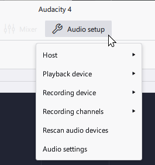

# Recording your voice with a microphone

## 1. Connect your Microphone

You can connect your mic by plugging it into the appropriate port. In general, this means:

* If you have a USB mic, plug it into a USB port.
* If you have a mic with a 3.5mm jack, plug it into a mic-in port.
* If you have an XLR mic, plug it into an XLR-USB audio interface and the interface into the USB port.

How you will connect your microphone will depend on your computer model and your microphone. Use your manuals or support pages for further information. You may need adapters if your computer does not have the correct ports for your microphone.


**Note:** Many laptops and notebooks feature built-in microphones. While they may be good enough to record your voice properly, other recordings that they produce will often be somewhat unpleasant.


## 2. Select your Microphone

Once you have plugged in your microphone into your computer, select the microphone using **Audio setup -> Recording devices**.

<figure><figcaption></figcaption></figure>


### Notes

* If your mic doesn't show up in Recording devices, click "**Rescan audio devices**".
* This menu may display some unexpected devices (for example, webcams), as well as virtual devices (software pretending to be a microphone).
* Most microphones are in **Mono**, and Mono is typically the best choice for recordings.&#x20;


## 3. Make a test recording

To start recording your voice in Audacity, simply press the red record button.

<figure><figcaption></figcaption></figure>

When you have ended the recording, listen back to it. If everything went well, you should now hear your voice clearly.&#x20;


### Best practices

If the meter next to the track goes into the red, or the waveform looks like a square block, you likely are recording too loud, resulting in distortion called _clipping_. Turn down your mic or move away from it to avoid clipping.\
&#x20;

If you see the meter next to the track stay close to the bottom, and barely see the waveform move at all, you likely are recording too quietly. Turn up your mic, or move closer to it. You can also raise the volume afterwards by amplifying it with the Amplify effect. \
 (1).png>)

If you click on the microphone button in the toolbar, you can see a meter with decibel markings. Typically the ideal range for your recording to sit at is at -18 to -12 dB, if you're speaking normally.\


