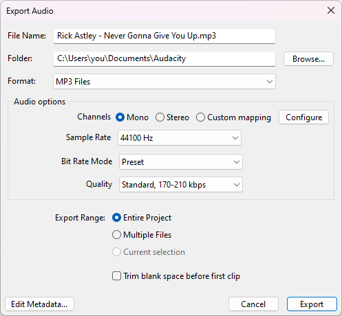

# Saving and exporting projects

## :cloud: Saving projects to cloud


This feature is only available in the Audacity 3.5 Beta. Try it now: [https://audacityteam.org/beta](https://audacityteam.org/beta)&#x20;



Cloud projects have backups and versioning, ensuring you'll never lose your work, even if your computer was to fail. Additionally, you can easily share them with collaborators.&#x20;


To save a project to the cloud, first go to **File -> Save to Cloud**. In the dialog that follows, click **Link Account**.

<figure><figcaption>
Save to audio.com
</figcaption></figure>

You will be guided through the [audio.com](https://audio.com) signup process, and finally given an option to link your [audio.com](https://audio.com) account to Audacity.&#x20;

Once you have linked your audio.com account to Audacity, simply **enter the project name** and hit **Save**. The project will now be uploaded in the background.

For the first time you save, you'll be asked how often you want to generate a mixdown. The mixdown is used to preview the file on [audio.com](https://audio.com). If you don't intend on collaborating with others, it may not be necessary to generate mixdowns. You can change your preference at any time in **Edit -> Preferences -> Cloud**.

## Saving projects to the computer (.aup3)

You can save projects using the **File -> Save Project -> Save Project** menu.&#x20;

A saved project has the most information about your project available. If you save a project, you can change [realtime effects](../audio-editing/using-realtime-effects.md) later on, or untrim clips.


**Warning:** Avoid saving active projects on external drives, USB sticks, or network storage. Audacity requires fast, uninterrupted access to your storage when recording and editing.&#x20;


## Exporting audio (.mp3, .wav, .ogg, ...)


**Note:** You may need to [install FFMPEG](installing-ffmpeg.md) to access some of these options.


You can export your project into an audio file using the **File -> Export Audio...** menu item. Exported audio files can be opened with a wide variety of programs.

<figure><figcaption>
The Export Audio Window
</figcaption></figure>


**Tips & Tricks**

* Use mono if you don't need directionality (eg. if you're just recording your voice).
* As an alternative to MP3, the Opus and M4A (AAC) options deliver higher quality at the same file size compared to MP3.
* As an alternative to WAV, the FLAC and Wavpack options offer lossless compression, reducing file sizes by up to half while not losing any information.


