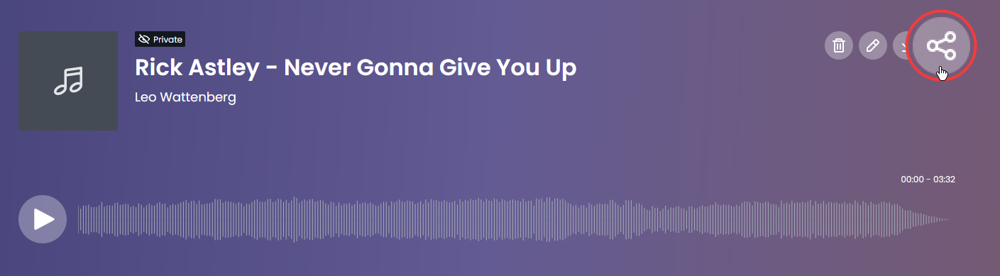

# 🆕 Sharing audio online


Video walkthrough of the feature


<figure><figcaption>
Location of the Share Audio button
</figcaption></figure>

With Audacity 3.2 you can quickly share audio online using the new service [audio.com](https://audio.com). To do this, simply click the **Share Audio** button.

You can now upload your audio by pressing **Continue**. If you'd like to link an existing audio.com first, you can do that by clicking **Link Account**.

<figure><figcaption></figcaption></figure>

Audacity will now prepare the track for upload and upload your audio.


**Note:** This may take a few minutes depending on how fast your computer is, how fast your internet connection is, and how long your audio is.&#x20;


After your audio has been uploaded, press **Continue**. You will be taken to the audio.com website.

<figure><figcaption></figcaption></figure>

On audio.com you now can either create an account to use this with, or copy the anonymous link. To share the link,&#x20;

1. Close the sign up panel,&#x20;
2. click the **share button** (shown below) and
3. select **Copy Link**

<figure><figcaption>
Location of the share button
</figcaption></figure>

You now can share your audio by sending this link to people.


All uploaded audio is private by default. Only people with access to the link can listen to it.


## Linking audio.com to Audacity

Linking your audio.com account to Audacity lets you get the sharable link from Audacity itself. To link your account,&#x20;

1. Press the **Share Audio** button.\
   Note: You need to have some sort of audio present in your project for this button to work
2. Your browser will open audio.com
3. **Login** or sign up if you aren't yet logged in
4. You will see the following page:\
   
5. Click on "**Link audacity**".
6. You may see a popup asking you whether you want to open in Audacity.\
   \
   Click the option that opens Audacity
