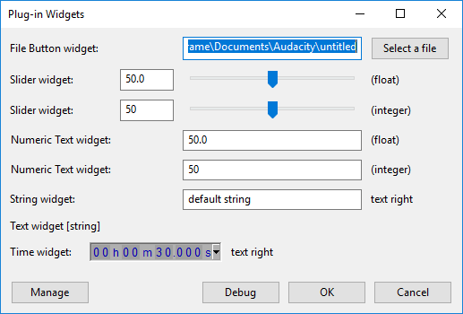

# Plugin Reference

* If you are looking for extra Nyquist plug-ins to use, see Nyquist Plug-ins.
* If you are especially interested in Nyquist in Audacity, we highly recommend subscribing to our [Audacity forum](https://forum.audacityteam.org/), which has a section [specifically for matters relating to Nyquist](https://forum.audacityteam.org/viewforum.php?f=39).

## Overview

Nyquist is a superset of the XLISP programming language, (a dialect of LISP and supports both a LISP syntax and an alternative syntax called SAL. A general introduction to Nyquist is given on the main Nyquist page.

The Audacity Nyquist Interface is implemented in the following files in the Audacity source code:

* audacity/src/effects/nyquist/Nyquist.cpp
* audacity/lib-src/libnyquist/nyx.c

Nyquist is in many ways a separate program from Audacity (and is also available as a [standalone programming language](https://www.cs.cmu.edu/\~music/nyquist/)). Nyquist is embedded in Audacity as a software [library](https://en.wikipedia.org/wiki/Library\_\(computing\)) that may be called from the main Audacity application to provide additional functionality, most notably as "plug-ins".

When a Nyquist plug-in is selected from one of Audacity's menus, Audacity locates the plug-in script (the ".NY" file), starts a Nyquist session and passes the Nyquist code to be interpreted by the Nyquist library. Nyquist then attempts to run the program. The result of running the Nyquist script is returned to Audacity.

## Nyquist Plug-in Header <a href="#nyquist_plug_in_header" id="nyquist_plug_in_header"></a>


As in most other computer languages, Nyquist supports code comments. Any line beginning with a semi-colon (;) is entirely ignored by Nyquist. Comments may also be placed at the end of a line of code by beginning the comment with a semi-colon. Nyquist ignores everything from the semi-colon to the end of the line.

In Audacity, special comments are used in Nyquist plug-ins to pass information to Audacity. As with other code comments, these are ignored entirely by Nyquist, but provide instructions to tell Audacity how to create the plug-in.


### Plug-in Header Example <a href="#plug_in_header_example" id="plug_in_header_example"></a>

In this example (derived from the [High-Pass Filter](https://manual.audacityteam.org/man/high\_pass\_filter.html) effect), the first four lines make up the essential headers that are required in all Nyquist plug-ins.

* `;nyquist plug-in`\
  This header tells Audacity that this file is a Nyquist plug-in.
* `;version 4`\
  This header specifies that this is a "4th generation" plug-in.
* `;type process`\
  This header defines the plug-in as a "process" (_Effect_) type.
* `;name "High-Pass Filter"`\
  This header tells Audacity the name of the plug-in.

```lisp
;nyquist plug-in
;version 4
;type process
;name "High-Pass Filter"
;preview linear
;manpage "High-Pass_Filter"
;debugbutton disabled
;action "Performing High-Pass Filter..."
;author "Dominic Mazzoni"
;release 3.0.2
;copyright "Released under terms of the GNU General Public License version 2 or later."

;control frequency "Frequency (Hz)" float-text "" 1000 0 nil
```

The other headers enable various options and properties, including the plug-in's controls.


Full descriptions of all plug-in headers are provide on the [Nyquist Plug-in Headers](headers-reference.md) page.


## Nyquist Plug-in Widgets <a href="#nyquist_plug_in_widgets" id="nyquist_plug_in_widgets"></a>

Nyquist plug-ins support a range of "widgets", which are control elements for a graphical user interface (GUI). These elements are unique to Nyquist in Audacity.

The GUI is created by Audacity when a plug-in contains one or more widget header commands.

As with other plug-in headers, they begin with a semicolon (**;**) and are ignored by Nyquist, except that the variable name of the widget is initialized with a value and made available to Nyquist. This means that Nyquist can access the value that has been set in the widget as the value of the variable specified in the widget header.


Note: The "Text widget" is an exception to the above at it is for display purposes only and does not set a value.


Each widget begins with "**;control**", and is followed by a number of parameters, one of which defines the _type_ of widget. There are currently nine widget types, though not all of them are available for old versions of Audacity.

When a plug-in is launched, Audacity searches the plug-in **.NY** file for valid headers. Every ";control" line that is found gets parsed by Audacity into several tokens, where each token is separated by spaces. If the tokens match one of the defined patterns, then Audacity adds the widget to the GUI, otherwise they are ignored.

### Syntax for widgets

| ;control | var-name | text-left |    widget-type   | text-right | initial-value |     minimum     |     maximum     |
| :------: | :------: | :-------: | :--------------: | :--------: | :-----------: | :-------------: | :-------------: |
| ;control | _symbol_ |  _string_ |      **int**     |  _string_  |   _integer_   |    _integer_    |    _integer_    |
| ;control | _symbol_ |  _string_ | **float** (real) |  _string_  |    _float_    |     _float_     |     _float_     |
| ;control | _symbol_ |  _string_ |   **int-text**   |  _string_  |   _integer_   | _integer / NIL_ | _integer / NIL_ |
| ;control | _symbol_ |  _string_ |  **float-text**  |  _string_  |    _float_    |  _float / NIL_  |  _float / NIL_  |
| ;control | _symbol_ |  _string_ |    **string**    |  _string_  |    _string_   |        -        |        -        |
| ;control | _symbol_ |  _string_ |    **choice**    |  _string_  |   _integer_   |        -        |        -        |
| ;control | _symbol_ |  _string_ |     **time**     |  _string_  |    _float_    |  _float / NIL_  |  _float / NIL_  |
| ;control | _symbol_ |  _string_ |     **file**     |  _string_  |    _string_   |     _string_    |     _string_    |
| ;control |     -    |     -     |     **text**     |  _string_  |       -       |        -        |        -        |



Note: "real" (deprecated) is an alternative name for "float" and is provided as legacy support for old plug-ins. It should not be used in new code.


_Italic_ words in the table denote data types. Because tokens are separated by whitepace, strings containing whitespace must be written within quotation marks.




Note: Older versions of Audacity may not support all of these controls, which may lead to an "unbound symbol" error. Plug-in users are encouraged to use the current version of Audacity, to ensure that they can benefit from all of the latest features.


The following code may be run in the [Nyquist Prompt](https://manual.audacityteam.org/man/nyquist\_prompt.html) of Audacity 2.3.1 or later, and produces the GUI shown above:

```lisp
;version 4
;name "Plug-in Widgets"

;control filename "File Button widget" file "" "" "" "open"
;control number-sw "Slider widget" float "(float)" 50 0 100
;control integer-sw "Slider widget" int "(integer)" 50 0 100
;control number-nt "Numeric Text widget" float-text "(float)" 50 0 100
;control integer-nt "Numeric Text widget" int-text "(integer)" 50 0 100
;control string-var "String widget" string "text right" "default string"
;control text "Text widget [string]"
;control duration "Time widget" time "text right" 30 nil nil

(format nil
        "File Selected: ~s~%~
        Floating point slider: ~s~%~
        Integer slider: ~s~%~
        Floating point text: ~s~%~
        Integer text: ~s~%~
        String: ~s~%~
        (Text widget does not return a value)~%~
        Duration: ~s (seconds)"
        filename
        number-sw
        integer-sw
        number-nt
        integer-nt
        string-var
        duration)
```

The detailed syntax for each widget type is described on the Nyquist Plug-ins Widgets page.

## Tracks and Selections <a href="#tracks_and_selections" id="tracks_and_selections"></a>

Audacity passes information about the current Audacity session to the Nyquist interpreter, along with the Nyquist code. Typically, when the code runs, it acts on data that has been passed from Audacity, which often includes the selected audio data, and returns data back to Audacity. Here we shall look at the ways that audio data is passed from Audacity to Nyquist, and from Nyquist back to Audacity.

### Passing Selected Audio to Nyquist <a href="#passing_selected_audio_to_nyquist" id="passing_selected_audio_to_nyquist"></a>

For process and analyze type plug-ins, Nyquist runs the plug-in code on each selected track in turn. The audio data is passed from Audacity to Nyquist as a variable called **\*TRACK\*** (the asterisks are part of the name).

* For mono tracks, the value of \*TRACK\* is a "sound" (which is a Nyquist [data type](https://en.wikipedia.org/wiki/Data\_type)).
* For stereo tracks, the value of \*TRACK\* is an "array". An array is a special kind of ordered list. The array has two elements, both of which are "sounds". The first element holds audio data from the left channel, and the second element hold data from the right channel.

The selected audio is only available to "process" and "analyze" type plug-ins (including the compound types "tool process" and "tool analyze").

### Time and Durations <a href="#time_and_durations" id="time_and_durations"></a>

The way that time and durations are handled depends on the type of plug-in.

For process and analyze type plug-ins, the start time of the selection is seen as "time = 0", and the length of the selection is seen as one unit of time. The absolute length of the sound in seconds can be computed one of the following ways:

```lisp
;Lisp
 (/ len *sound-srate*)
(get-duration 1)

;SAL
 len / *sound-srate*
get-duration(1)
```


NOTE: get-duration answers the question: "If a behavior has a nominal duration of 1, how long will it be after warping it according to the Nyquist environment?" Since many built-in behaviors like OSC and LFO have nominal durations of 1, In process effects, Audacity sets up the environment (including _warp_) to stretch them by the selection's duration. Otherwise, if you wrote (OSC C4), the result would have a duration of one second instead of the duration of the selection.


In 'generate' effects, this does not happen, so the length specified by the effect is the length that is produced. For example, if you write (OSC C4 3.5), a generate type effect will produce a tone of duration 3.5 seconds.

For generate type plug-ins, the length of the selection (if there is a selection) is usually ignored by Nyquist. However, if for some reason the length of the selection needs to be known, then \*SELECTION\* **START** and **END** properties may be used (version 4 plug-ins or later).

When generating sounds with a 'generate' type plug-in, durations in Nyquist represent seconds. For example, to generate a 2.5 second sine tone, you could write:

```lisp
;type generate
(osc 60 2.5)
```

but if the same code is used in a 'process' type plug-in, the generated tone will be 2.5 x the duration of the track selection:

```lisp
;type process
(osc 60 2.5)
```

If a duration in seconds is required in a 'process' type plug-in, this may be done using the [ABS-ENV](http://www.cs.cmu.edu/\~rbd/doc/nyquist/part8.html#index583) command:

```lisp
;type process
(abs-env (osc 60 2.5))
```

The above examples may be run in the [Nyquist Prompt](https://manual.audacityteam.org/man/nyquist\_prompt.html).

## Global Variables and Reserved Variable Names <a href="#global_variables_and_reserved_variable_names" id="global_variables_and_reserved_variable_names"></a>

In addition to the standard global variables defined in the [Nyquist Reference Manual](http://www.cs.cmu.edu/\~rbd/doc/nyquist/part9.html), Nyquist in Audacity also has global variables that relate specifically to Audacity. Listed here are a few common standard Nyquist globals, and global variables that are relevant to Nyquist in Audacity.

* [**\*CONTROL-SRATE\***](http://www.cs.cmu.edu/\~rbd/doc/nyquist/part9.html#index844) : \[float] The sample frequency of the control signals (such as those created by [piecewise approximations](http://www.cs.cmu.edu/\~rbd/doc/nyquist/part8.html#index389). By default 1/20 of the sample rate of the track.
* **\*DECIMAL-SEPARATOR\*** : \[char] A comma character (#\\') or dot character (#\\.) depending on the language selected in [Audacity's Preferences](https://manual.audacityteam.org/man/interface\_preferences.html).
* **\*FILE-SEPARATOR\*** : \[char] The character that separates directories in a path, e.g. "/" (#\\/) for Unix, ":" (#\\:) for Mac, and "\\" (#\\\\) for Win32.
* **LEN** : \[int] The number of samples contained in the selected Audacity sound.
* **\*LOCALE\*** : \[list] This is variable name is reserved for [translation strings](broken-reference).
* **\*PREVIEWP\*** : \[bool] True when previewing an effect, otherwise false.
* **\*RUNTIME-PATH\*** : \[string] Path to Nyquist .lsp files.
* **\*PROJECT\*** : A variable with a list of properties relating to the current Audacity project.
* **S** (obsolete) : \[sound or array of two sounds] Prior to version 4 plug-ins, in process and analyze type plug-ins this was the Audacity sound \[the selected part of the Audacity audio track]. In generate type plug-ins "S" is the [Adagio notation](http://www.cs.cmu.edu/\~rbd/doc/nyquist/part11.html) for a _quarter note_ (float value 0.25).
* [**S**](http://www.cs.cmu.edu/\~rbd/doc/nyquist/part2.html#index53) : [Adagio notation](http://www.cs.cmu.edu/\~rbd/doc/nyquist/part11.html). \[float] A _quarter note_ (float value 0.25).
* **\*SCRATCH\*** : \[any] a symbol whose value and property list are preserved from one effect invocation to the next.
* **\*SELECTION\*** : A variable with a list of properties relating to the current selection.
* [**\*SOUND-SRATE\***](http://www.cs.cmu.edu/\~rbd/doc/nyquist/part9.html#index868) : \[float] The sample frequency of the selected track audio.
* **\*SYSTEM-DIR\*** : A variable with a list of properties relating to the file system.
* **\*SYSTEM-TIME\*** : A variable with a list of properties relating to the system time/date.
* **\*TRACK\*** : \[sound or array of sounds] The Audacity sound \[the selected part of the Audacity audio track]. The \*TRACK\* variable also has a list of "properties" that pass additional information to Nyquist.
* [**\*WARP\***](http://www.cs.cmu.edu/\~rbd/doc/nyquist/part4.html#index144) : information that communicates start-time and duration to Nyquist functions. In Audacity, the start-time is always considered to be zero (regardless of the actual start time of the selection) and the duration indicates the duration of the selection. \*warp\* should not normally be accessed directly.

Other global variables provided by Nyquist can be found in the [Nyquist manual index](http://www.cs.cmu.edu/\~rbd/doc/nyquist/indx.html).

## Global Property Lists <a href="#global_property_lists" id="global_property_lists"></a>

Property lists are defined for the global variables \*AUDACITY\*, \*PROJECT\*, \*SELECTION\*, \*SYSTEM-DIR\*, \*SYSTEM-TIME\*, and \*TRACK\*.&#x20;

For examples using property lists, see the [Nyquist Property List Tutorial](tutorials/property-list-tutorial.md).

### \*AUDACITY\*

This property list was added in Audacity version 2.1.0

**Value:** Unbound (not defined).

* **LANGUAGE** : \[string] The country code for the language set in [Audacity Preferences](http://manual.audacityteam.org/man/interface\_preferences.html#display).\
  Example - when Audacity's locale setting is for English, `(print (get '*audacity* 'language))`will print `en`.
* **VERSION** : \[integer list] A list in the form (Audacity\_version Audacity\_release Audacity\_revision)\
  Example: Print the full Audacity version for Audacity 2.1.3\
  `(let ((version-list (get '*audacity*' version)))`\
  `(format nil "Audacity version ~a.~a.~a" (first version-list)(second version-list)(third version-list)))`\
  Prints: Audacity version 2.1.3

### \*PROJECT\*

**Value:** Unbound (not defined).

* **LABELTRACKS** : \[integer] The number of label tracks in the project.
* **MIDITRACKS** : \[integer] The number of note tracks in the project.
* **NAME** : \[string] The name of the current project. A project that has not been named (not yet saved) returns an empty string.
* **PREVIEW-DURATION** : \[float] The [Effects Preview Length](https://manual.audacityteam.org/man/playback\_preferences.html) set in Audacity preferences.
* **PROJECTS** : \[integer] The number of open projects.
* **RATE** : \[integer] The project rate in the project.
* **TIMETRACKS** : \[integer] The number of time tracks in the project.
* **TRACKS** : \[integer] The number of tracks in the project.
* **WAVETRACKS** : \[integer] The number of audio tracks in the project.

### \*SELECTION\*

**Value:** Unbound (not defined).

* **BANDWIDTH** : \[float] The bandwidth of the frequency selection in octaves (Spectrogram or Spectrogram (log f) track view).
* **CENTER-HZ** : \[float] The centre frequency selection in Hz (Spectrogram or Spectrogram (log f) track view).
* **CHANNELS** : \[integer] The number of selected audio channels.
* **END** : \[float] The end of the selection in seconds.
* **HIGH-HZ** : \[float] The high frequency selection Hz (Spectrogram or Spectrogram (log f) track view).
* **LOW-HZ** : \[float] The low frequency selection Hz (Spectrogram or Spectrogram (log f) track view).
* **RMS** : \[float or array] For mono tracks, the [RMS](https://manual.audacityteam.org/man/glossary.html#rms) amplitude (linear scale). For stereo tracks, an array containing the RMS for each channel.
* **PEAK** : \[float or array] For mono tracks, the absolute peak level (linear scale). For stereo tracks, an array containing the absolute peak level for each channel. Returns 'NIL' if peak level is infinite or [NaN](https://en.wikipedia.org/wiki/NaN).
* **PEAK-LEVEL** : \[float] The absolute peak level (linear scale). Returns 'NIL' if peak level is infinite or NaN.
* **START** : \[float] The start of the selection in seconds.
* **TRACKS** : \[integer list] A list of track numbers of selected audio tracks.

### \*SYSTEM-DIR\* <a href="#system_dir" id="system_dir"></a>

**Value:** Unbound (not defined).

* **BASE** : \[string] The Audacity installation directory.
* **DATA** : \[string] The Audacity data directory. This is where the audacity.cfg, plug-inregistry.cfg and EQCurves.xml files are located.
* **DOCUMENTS** \[string] The system default documents directory.
* **HELP** : \[string] The installation directory for the Audacity Manual (note that the Manual may not exist).
* **HOME** : \[string] The current user's "[home](https://en.wikipedia.org/wiki/Home\_directory)" directory.
* **PLUG-IN** : \[string list] The Nyquist plug-in search path. This includes the directories where Audacity looks for Nyquist plug-ins, and other Nyquist related files. Not all directories are currently used and some are for legacy support only.
* **SYS-TEMP** : \[string] The system temp directory.
* **TEMP** : \[string] The Audacity temp directory. This is where unsaved project data is temporarily stored.
* **USER-PLUG-IN** : \[string] The default path for user plug-ins.

### \*SYSTEM-TIME\* <a href="#system_time" id="system_time"></a>

This property list was added in Audacity version 2.1.1.

**Value:** A list in the form '(year, day, hours, minutes, seconds), where each list item is an integer.

**Example:** 5 minutes past 2pm January 1st 2022 would be the list: `2022, 1, 14, 5, 0`.


Note that "day" is a number in the range 1 to 366, counted from the start of the year.


This is the time that the Nyquist code is parsed, NOT the time it is executed. It cannot therefore be used for timing events that occur while the code is running. Possible uses for \*SYSTEM-TIME\* could include automatic naming of files written to disk, or for "[seeding](https://en.wikipedia.org/wiki/Random\_seed)" random processes.

* **DATE** : \[string] The date formatted according to the current locale. Example: "dd/mm/yy".
* **DAY** : \[integer] Day of the month.
* **DAY-NAME** : \[string] The name of the day (Example: "Monday").
* **ISO-DATE** : \[string] The date represented in the ISO 8601 format "YYYY-MM-DD".
* **ISO-TIME** : \[string] The time represented in the ISO 8601 format "HH:MM:SS".
* **MONTH** : \[integer] The month (as an integer).
* **MONTH-NAME** : \[string] The name of the month (Example: "January").
* **TIME** : \[string] The time formatted according to the current locale. Example: "hh:mm:ss".
* **YEAR** : \[integer] The year (as an integer).

### \*TRACK\*

**Value:** The _sound_ from a selected mono audio track, or an array of two sounds from a selected stereo track (see the Nyquist Stereo Track Tutorial).

Properties of \*TRACK\* all relate to the track that is being processed. Currently Nyquist only processes audio tracks. When multiple tracks are selected, Nyquist processes each audio track in turn (top to bottom).

* **CHANNELS** : \[integer] The number of channels in the track (mono = 1, stereo = 2).
* **CLIPS** : \[list or array] For mono tracks, a list of start and end time of each audio clip. For stereo tracks, an array containing a list of clips for each channel.\
  Due to a limitation in Nyquist, the "clips" property can hold a maximum of 1000 start / end times.\
  &#x20;  If an audio channel contains more than 1000 clips, the first 1000 will be listed, and the 1001th item will be NIL.\
  &#x20;  See [AUD-GET-INFO](https://manual.audacityteam.org/man/nyquist\_macros.html#AUD-GET-INFO) for an alternative way to get clip times that will work with 1000's of clips.
* **END-TIME** : \[float] The track end time.
* **FORMAT** : \[integer or float] The track sample format. One of (Integer) 16, (Integer) 24, or (float) 32.
* **GAIN** : \[float] The value of the track Gain slider.
* **INDEX** : \[integer] A counter that increments for each track processed. On processing the first track, the value is "1".
* **NAME** : \[string] The name of the track.
* **PAN** : \[float] The value of the track Pan slider.
* **RATE** : \[float] The track sample rate.
* **SPECTRAL-EDIT-ENABLED** : \[bool] Returns 'T' (_true_) if [spectral editing is enabled](https://manual.audacityteam.org/man/spectrograms\_preferences.html#Enable\_Spectral\_Selection), otherwise 'NIL'. Note that this is irrespective of the track view and will return 'T' if the spectral editing option for the track is enabled even if the track is not displaying a spectrogram.
* **START-TIME** : \[float] The track start time (note that this will often be different from the _selection_ start time.)
* **TYPE** : \[string] The type of track. One of: "wave", "midi", "label", "time". Currently only "wave" (audio tracks) are processed by Nyquist plug-ins.
* **VIEW** : \[string or list] The track view. Only applies to audio tracks.\
  \* A single track view returns one of "Waveform", "Spectrogram" or NIL. [Multi-View](https://manual.audacityteam.org/man/multi\_view.html) returns a list of strings or NIL.\
  \* Multi-view returns the upper view as the first element, and the lower view as the second (either "Waveform" or "Spectrogram"). Both normal "Waveform" and "Waveform (dB)" return the string "Waveform".\
  \* Prior to Audacity 2.4.x : \[string] One of: "Waveform", "Waveform (dB)", "Spectrogram" or NIL.

The _VIEW_ property may change in future versions of Audacity, so is not recommended for public release plug-ins. During Preview, audio tracks are copied to temporary tracks which are not visible, so the returned "VIEW" value is NIL.

## Return Values <a href="#return_values" id="return_values"></a>

Nyquist supports many _"data types_", including "numbers" (integer or floating-point), "characters" (such as the letter "A", the number "4", or any other [ASCII character](https://en.wikipedia.org/wiki/ASCII)), "strings" (text), "[list](https://en.wikipedia.org/wiki/List\_\(abstract\_data\_type\))" (a list of data), "[array](https://en.wikipedia.org/wiki/Array\_data\_type)" (special kind of indexed list), and "sounds" (a sound / digital signal).

The result of the last computation within the plug-in code will be given back from Nyquist to Audacity. According to the _data type_ of the returned value one of the following actions will be invoked in Audacity:

### Mono Sound <a href="#mono_sound" id="mono_sound"></a>

If a "sound" is returned, the sound will be re-inserted into the selected part of the Audacity track, (or a new track for "generate" type plug-ins). If the returned sound is shorter or longer than the original sound, the selection will be reduced or augmented. If a mono sound is returned to a stereo track, the same mono sound will be inserted into both channels of the stereo track.

### Multi-Channel / Stereo Sound <a href="#multi_channel_stereo_sound" id="multi_channel_stereo_sound"></a>

Nyquist handles multi-channel sounds as an _array_ of _sounds_. The first element of the array is the left channel, and the second element is the right channel. Audacity currently supports a maximum of two channels in a track (stereo).

Returning an array of sounds to a mono track is an error._To return a stereo sound without error, a stereo track must be selected before running the Nyquist code._

For more information about stereo tracks, see the [Nyquist Stereo Track Tutorial](tutorials/stereo-tracks-tutorial.md).

### String / Text <a href="#string_text" id="string_text"></a>

When the return value is a character or string, a dialog window will appear with the data displayed as text.

### Number

A dialog window will appear with the number displayed as text.

### Labels

If an appropriately formatted list is returned to Audacity, a label track will be created below the audio track(s).

For point labels the format is:

&#x20;`((`_`number`_` ``"`_`string`_`") (`_`number`_` ``"`_`string`_`") ... )`

The list to create a label track must contain one or more lists, each of which must have:

* _number_ - (an integer or float) is the time in seconds from the beginning of the Audacity selection, where the label will appear.
* "string" - a string to be displayed in the label's text field.

For region labels, each label list must contain two _int-or-float_ elements, one for the start and one for the end of the label region.

&#x20;`((`_`number`_` ```` `_`number`_` ``"`_`string`_`") (`_`number`_` ```` `_`number`_` ``"`_`string`_`") ... )`

Audacity will always place returned audio or labels relative to the start of the [selection](https://manual.audacityteam.org/man/Audacity\_Selection) and not the start of the [Timeline](https://manual.audacityteam.org/man/Timeline).

#### Empty String <a href="#empty_string" id="empty_string"></a>

An empty string may be used as a "null return", which means that the plug-in returns nothing, and no error. An example use would be if you wish to process only the first selected track.

```lisp
;; Example: Apply a function "process" to
;; the first selected track only.

(if (= (get '*track* 'index) 1)
    (process *track*)
    "")
```

## Playing sounds with Nyquist <a href="#playing_sounds_with_nyquist" id="playing_sounds_with_nyquist"></a>

When using the [Nyquist Prompt](https://manual.audacityteam.org/man/nyquist\_prompt.html) or (most) Nyquist plug-ins that have a [GUI](https://en.wikipedia.org/wiki/Graphical\_user\_interface), if the plug-in returns a sound, it may be previewed using the `Preview` button. In addition to this, it is also possible to play sounds directly from Nyquist, using the [PLAY](http://www.cs.cmu.edu/\~rbd/doc/nyquist/part8.html#index626) function. The PLAY function will be executed when the plug-in code runs.&#x20;


The PLAY function is described in the [Nyquist manual](http://www.cs.cmu.edu/\~rbd/doc/nyquist/part8.html#index626). The information here describes aspects that are specific to Nyquist in Audacity.


Note that the Nyquist PLAY command does not use Audacity's [audio device settings](http://manual.audacityteam.org/man/devices\_preferences.html). Nyquist uses the system default device for playback, and has a default buffer of 100 ms. The buffer setting may be changed with the [SND-SET-LATENCY](http://www.cs.cmu.edu/\~rbd/doc/nyquist/part8.html#index340) command. The actual latency values are dependent on the computer sound system and may differ from those requested by Nyquist.

To see the list of available devices when Nyquist plays, set \*snd-list-device\* to "true" before the play command, then use `Debug` button to see the output.

`(setf *snd-list-devices* t)`\
`(play *track*)`

To select a specific output device, set \*snd-device\* to the index number of the device you wish to use (not all devices are valid). For example, if ALSA hw(0,0) is device 0, select it with:

`(setf *snd-device* 0)`\
`(setf *snd-list-devices* t)`\
`(play *track*)`


It is not possible to interrupt Nyquist playback. The sound will continue playing until it reaches the end, and other Audacity functions are disabled until Nyquist playback has finished.


To limit the amount of audio that will play, the length of the sound must be defined before starting playback. For example, to play the first 1 second of a selection, you could write (LISP syntax):

```lisp
(play (extract-abs 0 1 *track*))
```

Note also that if a plug-in uses Nyquist PLAY command, using `Preview`will cause an error on some machines because Audacity may not be able to access the audio device while it is being used by Nyquist. For "own use" plug-ins, if you have more than one sound card, a possible workaround to enable Preview and Nyquist PLAY simultaneously, is to set the Nyquist playback device to a different device to that which Audacity uses. For public release plug-ins the `Preview` button should normally be disabled if Nyquist PLAY is used.

## Plug-in Translations <a href="#plug_in_translations" id="plug_in_translations"></a>

Nyquist plug-ins provide two mechanisms for translation into the language specified in Audacity's preferences.

One method is exclusively for plug-ins that are shipped by default with Audacity and requires compiling Audacity from source, plus several other steps involving [gettext](https://www.gnu.org/software/gettext/). Unfortunately this method is not documented, so only a brief description is provided here.

The other method may be used by plug-in developers for their "third party" plug-ins, but can be used only for returned strings and not for the main plug-in interface.

### Translation for shipped effects <a href="#translation_for_shipped_effects" id="translation_for_shipped_effects"></a>

Header comments in translated plug-ins begin with a dollar "$" character rather than the usual semicolon ";" character. The strings to be translated are then wrapped in a function that has a one character name "\_" (underscore).

**Example:** In the [Adjustable Fade](https://manual.audacityteam.org/man/adjustable\_fade.html) effect, the [Name](broken-reference) header is changed from:

&#x20;`;name "Adjustable Fade"`

to:

&#x20;`$name (_ "Adjustable Fade")`

**;control** lines become **$control**. As with other translated headers, the **$** symbol replaces the normal semicolon. The line is ignored by Nyquist as a _comment_, but is visible to Audacity for translation and for creating a [widget](broken-reference).

The options in Multiple-choice widgets may be translated. For example:

&#x20;`;control var (_ "Translated left text") choice ((_ "Yes") (_ "No")) 0`


The above example is not safe to use. See the "Limitations" section below.


**Macros and portability:** To allow portability of settings and macros, choices may include a non-translated form of each choice. The non-translated form is used by Macros but is not normally visible to users.

&#x20;`;control var (_ "Translated left text") choice (("Label1" (_ "Translated Label 1")) ("Label2" (_ "Translated Label 2"))) 0`

**Other user visible strings:** Other strings that are visible to users are marked for translation using the "underscore" function. An example from the Adjustable Fade plug-in:

&#x20;`(format nil (_ "~aPercentage values cannot be negative.") err)`

### **Limitations**

Control characters like  (new line),  (tab) are not supported. The workaround is to use Lisp format directives instead:

* **Bad** (does not work correctly):

&#x20;`(print (_ "Line one.\nLine two."))`

* **Good**:

&#x20;`(print (format nil (_ "Line one.~%Line two.")))`

Note that translations may contain Unicode characters that are not supported by Nyquist. It is therefore important that any translated strings that need to be _machine readable_ (such as Multiple-Choice widget options) _**should**_ also have a non-translated form.

&#x20;`;control var (_ "Translated left text") choice (("Label1" (_ "Translated Label 1")) ("Label2" (_ "Translated Label 2"))) 0`

### Translation for third party effects <a href="#translation_for_third_party_effects" id="translation_for_third_party_effects"></a>


It is not currently possible to provide translations for a third party plug-in's main interface, unless the name is the same as a translated Nyquist plug-in that is already shipped with Audacity. It is highly recommended to NOT reuse the same name as a shipped plug-in for a third party plug-in.


Translations may be provided for return value messages and debug messages. To do this, the string must be marked for translation by wrapping it in the "underscore" function. The translation must also be provided in a specially formatted list variable **\*locale\***.

The format for the \*locale\* list is: `(LIST (language-list) [(language-list) ...])`

where "language-list" is a list in the form: `(LIST country-code (translations))`

and the "translations" are list in the form: `(LIST (List "string" "translation") [(List "string" "translation")...])`

* The \*locale\* list may contain any number of "language-list" elements, where each language-list is a list of two strings.
* The first element of each "language-list" is the country code (for example "en" or "fr"),
* The second item of each "language-list" is a list of translation pairs.
* A "translation pair" is a list containing the default string (usually in English) and the translated string (in the language specified by the country code).

A working example may be found in the [RMS effect](https://github.com/audacity/audacity/blob/master/plug-ins/rms.ny).

## See Also <a href="#see_also" id="see_also"></a>

* [Nyquist](https://manual.audacityteam.org/man/nyquist.html) in the Audacity manual
* Nyquist [Basics ](basics/)and [Tutorials](tutorials/)
* [Nyquist 3.02 Reference Manual](http://www.cs.cmu.edu/\~rbd/doc/nyquist/)
* [XLISP 2.0 Manual](http://www.audacity-forum.de/download/edgar/nyquist/nyquist-doc/xlisp/xlisp-index.htm)
