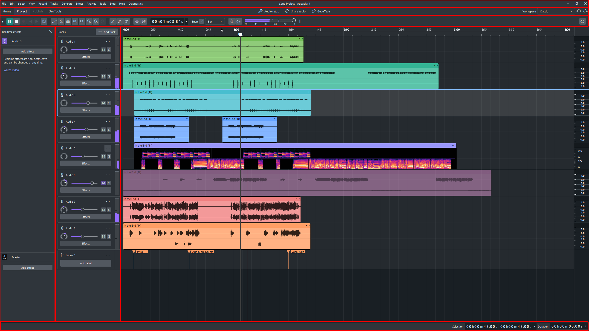

# Manual Index

This documentation is split via grouping based on UI presence.&#x20;

<figure><figcaption></figcaption></figure>

Each block represents it's own set of features, that can be accessed as shown in each individual chapter.&#x20;

Here is a list of all pages that explain each block individually:

Header Menu

Project Management Menu

Toolbar&#x20;

Realtime Effects

Track Header

Project View

Transport View

