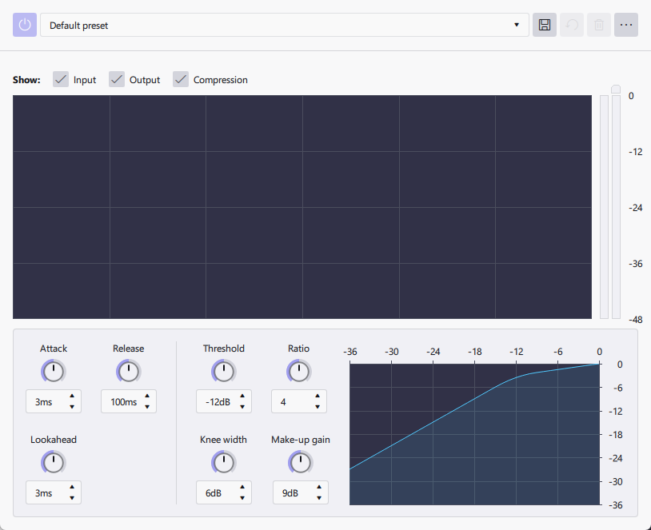

# Effects

## Realtime Effects

You can enable Realtime effects for individiual track or to use as a master track

### Compressor

<figure><figcaption></figcaption></figure>

#### UI

Main View

Knee View

Show

* Input
* Output
* Compression

Peaking meter

#### Attack

#### Release

#### Lookahead

#### Threshold

#### Ratio

#### Knee width

#### Make-up gain

### Limiter

### Reverb

