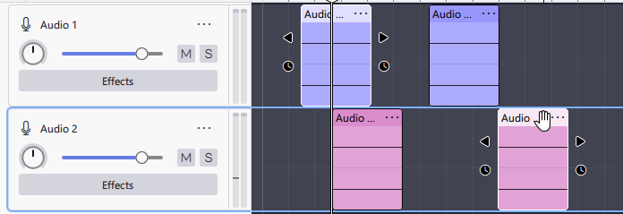

# Audacity 3 to 4 transition guide

With Audacity 4, we've tried to modernize the app while keeping things still feeling Audacity. That said, there are some notable differences.

## Onboarding

During onboarding, you'll be asked for app theme (light or dark), clip theme and workspace. The "Classic" clip theme and workspace are designed to keep things as close to Audacity 3 as possible, keeping all the same tools and buttons.&#x20;

## Knobs

In addition to sliders, we've added a new Knob control. To increase the value of a knob, simply click it and drag it up or right, to decrease it, drag it down or left. Double-clicking resets the knob value, `Shift`+dragging lets you do finer adjustments.

## Sync Lock

Sync lock has been replaced by ripple editing. You can set your default delete behavior in Preferences -> Editing. To make an edit while keeping all tracks in sync, use "Delete and close gap (all tracks)" (`Ctrl+Delete`) and "Insert and preserve sync" (`Ctrl+Shift+V`), respectively. You can edit these shortcuts in preferences.

## Clips

In Audacity 4, clips can be selected directly, and multiple clips can be selected with Shift+Click even when the clips aren't touching.

<figure><figcaption></figcaption></figure>

You can trim and stretch all selected clips at once using the handles that appear on the side of selected clips. You can also move clips on top of other existing clips; doing so will cause the existing clip to be "eaten" into.

## Plugins

At the time of writing (before the first alpha), only the following plugin formats are supported: VST3, VST, AU (macOS only), LV2 (Linux only). The remaining plugin formats (LADSPA, Nyquist, VAMP, as well as new ones like CLAP) may be (re-)added in the future.&#x20;

## Tool modes

We have replaced the following tool modes: Select tool (`F1`), Envelope tool (`F2`), Draw tool (`F3`), and Multi-tool (`F6`). Instead, envelopes are a visual layer which can be toggled visible using the Automation button.

<figure><figcaption></figcaption></figure>

The Draw tool is automatically engaged when you're zoomed in enough to see individual samples; your cursor will turn to a pencil as you get close to a sample point.

A new tool mode has been added, Split tool. The split tool can be engaged by pressing or holding `S`, and allows you to quickly split clips into two.&#x20;
