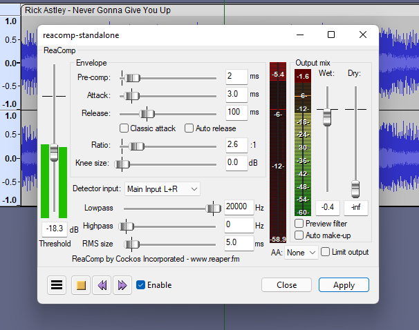
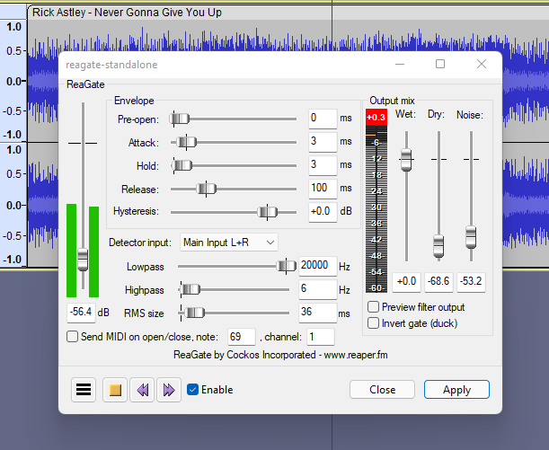

# Dynamics Processing

## ReaComp

A compressor effect, part of ReaPlugs.


Download page


Details

Copyright (C) 2006-2016, Cockos Incorporated VST PlugIn Technology by Steinberg Media Technologies GmbH

Information From the vendor:

* Ultra-configurable compressor
* Soft knee support
* Sidechain filters, sidechain inputs
* Feedback compression mode
* Program dependent auto-release mode
* Variable RMS size
* Oversampling antialias modes (with optional limiting)
* Optional make-up gain
* Optional lookahead
* Wet/dry mix
* Low CPU use
* Useful metering

## ReaFIR

A multi-purpose dynamics processor, can be used for EQ, compressor, gate and noise reduction purposes. Part of ReaPlugs.


Download page


Details

Copyright (C) 2006-2016, Cockos Incorporated VST PlugIn Technology by Steinberg Media Technologies GmbH

Information from the vendor:

* FFT based dynamics processor
* Supports FFT sizes of 128-32768
* Useful in/out frequency response display
* Supports defining response curves both using any number of points, or freehand mouse
* EQ - can be used as a linear phase mastering EQ, or as a super-effective surgical EQ
* Compressor - can compress at a fixed ratio with a per-band threshold
* Gate - can gate with per-band threshold
* Subtract - can build noise profiles and subtract noise from the signal

## ReaGate

A noise gate effect, part of ReaPlugs.


Download page


Details

Copyright (C) 2006-2016, Cockos Incorporated VST PlugIn Technology by Steinberg Media Technologies GmbH

Information From the vendor:

* Ultra-configurable gate
* Sidechain filters, sidechain input
* Lookahead for pre-open
* Hold control
* Hysteresis control
* Variable RMS size
* Can send MIDI events on gate open/close
* Wet/dry mix, noise mix (can add noise when gate is open)

## ReaXcomp

A multi-band compressor effect, part of ReaPlugs.


Download page


Details

Copyright (C) 2006-2016, Cockos Incorporated VST PlugIn Technology by Steinberg Media Technologies GmbH

Information From the vendor:

* Unlimited band compressor
* Great metering per band
* Fantastic sounding filters
* Solo current band mode
* Tons of controls per band (ratio, threshold, knee, attack, release, makeup, program dependent release, feedback detector, RMS size)
* Adjusting bands in graph is easy (modifiers to change ratio, gain, etc)

