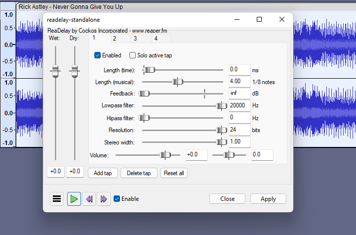

# Delay and Reverb

## ReaDelay

A multi-tap delay effect, part of ReaPlugs.


Download page


Details

Copyright (C) 2006-2016, Cockos Incorporated VST PlugIn Technology by Steinberg Media Technologies GmbH

Information From the vendor:

* Multi-tap delay, no practical limit on tap count
* Up to 10 second delay per tap
* Tap lengths can be in time (s/ms) or quarter notes
* Feedback, LPF/HPF, resolution reduction per tap
* Stereo width per tap
* Volume/pan per tap

## MConvolutionEZ

An easy-to-use highly optimized convolution reverb, part of the [#mfreefxbundle](plugin-suites.md#mfreefxbundle "mention") pack

Details

**MConvolutionEZ** is an easy-to-use highly optimized convolution reverb. Comes with lots of impulse responses for rooms, halls, plates, guitar cabinets, effects.

* Advanced GUI
* Compare multiple settings: A to H Switching and A to D Morphing.
* Unique visualisation engine with classic meters and time graphs
* MIDI controllers with MIDI learn
* M/S, single channel, up to 8 channels surround and up to 64 channels ambisonics processing
* Extremely fast, optimized for newest AVX2 and AVX512 capable processors
* Supports VST, VST3, AU and AAX interfaces on Windows and macOS

See the [pack ](plugin-suites.md#mfreefxbundle)for installation instructions.&#x20;

## MCharmVerb

A Lush algorithmic reverb effect, , part of the [#mfreefxbundle](plugin-suites.md#mfreefxbundle "mention") pack

Details

MCharmVerb is a great sounding lush algorithmic reverb based on the MTurboReverb engine.

* Advanced GUI
* Compare multiple settings: A to H Switching and A to D Morphing.
* Unique visualisation engine with classic meters and time graphs
* MIDI controllers with MIDI learn
* Automatic gain compensation (AGC)
* M/S, single channel, up to 8 channels surround and up to 64 channels ambisonics processing
* Extremely fast, optimized for newest AVX2 and AVX512 capable processors
* Supports VST, VST3, AU and AAX interfaces on Windows and macOS

See the [pack ](plugin-suites.md#mfreefxbundle)for installation instructions.&#x20;

## OrilRiver

A free algorithmic stereo reverb


Download link


Details

* 12 early reflections variations
* 5 reverb tail variations
* 3-band equalizer for the wet signal
* Sample Rate: from 44100 to 192000 Hz.
* Lots of presets

## TAL-Reverb-4

A plate reverb with a vintage 80's character


Download link


Details

Information from the developer website:

* Modulated vintage reverb sound.
* Very diffuse sound.
* Fast build up time, also with long reverb sounds.
* Works on almost every audio material.
* Easy to use.
* Only stereo channels supported.

## U-he Protoverb

A natural sounding reverb based on the concept of a room simulator



Details

Information from the developer website:

Protoverb is an experimental room simulator reverb. Most algorithmic reverbs try to avoid resonances or model the reflections of sound from a room’s walls. Protoverb does the opposite. It builds up as many room resonances as possible, modelling the body of air in the room. No need to modulate or colour the signal. The result is a very natural sounding reverberation with interesting characteristics:

Notes held for a longer time tend to build up resonance, as if the air takes a while to get excited Multiple instruments remain distinct, without disappearing in a wash When you play a short melody, the room seems to repeat a ghost echo of that melody These properties are found in churches and large halls, but are rarely in conventional algorithmic reverbs.

To achieve this, Protoverb works with many parallel, serial and networked delays. With such a structure, no mathematical formula can make it sound right, it is down to trial and error (and luck) using random values. Protoverb generates random delay line lengths, networks and feedback strategies.

## Voxengo OldSkoolVerb

OldSkoolVerb offers you a comprehensive set of parameters permitting you to achieve various reverbs ranging from plate reverb to room reverb to hall reverb sound.


Download link


Details

Information from the developer website:

* Plate, room, and hall reverbs
* 5 reverb modes
* Reverb mode editor
* Stereo processing
* 64-bit floating point processing
* Preset manager
* Undo/redo history
* A/B comparisons
* Contextual hint messages
* All sample rates support
* Zero processing latency
* User interface color schemes
* Resizable user interface
* Retina and HighDPI support

## Valhalla Supermassive

ValhallaSupermassive lets you create massive reverbs, harmonic echoes and space sounds


Download link


Details

Information from the developer website:

ValhallaSupermassive is based around feedback delay networks. The individual delays can have up to 2 second of delay time, with user control over the delay lengths, the feedback, how the delays mix with each other, and the modulation rate and depth of the delays. The sonic results range from choruses and flangers, to echoes that fade in and out over time, to massive lush reverbs, and onwards to weird spatial effects that have to be heard to be believed.

## See also

* Nyquist [delay-and-reverb.md](../nyquist-plugins/effect-plugins/delay-and-reverb.md "mention") effects
