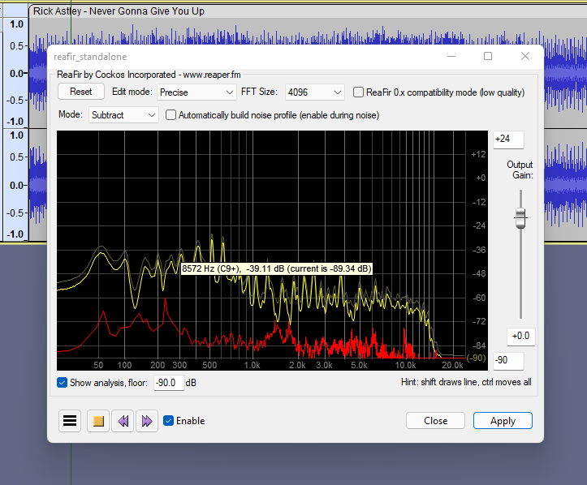

# Dynamics Processing

## ReaFIR

A multi-purpose dynamics processor, can be used for EQ, compressor, gate and noise reduction purposes. Part of ReaPlugs.


Download page


Details

Copyright (C) 2006-2016, Cockos Incorporated VST PlugIn Technology by Steinberg Media Technologies GmbH

Information from the vendor:

* FFT based dynamics processor
* Supports FFT sizes of 128-32768
* Useful in/out frequency response display
* Supports defining response curves both using any number of points, or freehand mouse
* EQ - can be used as a linear phase mastering EQ, or as a super-effective surgical EQ
* Compressor - can compress at a fixed ratio with a per-band threshold
* Gate - can gate with per-band threshold
* Subtract - can build noise profiles and subtract noise from the signal

## MCompressor

A powerful compressor with custom processing shape, part of the [#mfreefxbundle](plugin-suites.md#mfreefxbundle "mention") pack

Details

MCompressor provides refined compression. It features an adjustable compression shape, giving you the power to create dynamic sound effects, and a range of up-sampling options for a crystal clear sound.

* Advanced GUI
* Compare multiple settings: A to H Switching and A to D Morphing.
* Unique visualisation engine with classic meters and time graphs
* MIDI controllers with MIDI learn
* M/S, single channel, up to 8 channelds surround and up to 64 channels ambisonics processing
* Extremely fast, optimized for newest AVX2 and AVX512 capable processors
* Supports VST, VST3, AU and AAX interfaces on Windows and macOS

See the [pack ](plugin-suites.md#mfreefxbundle)for installation instructions.

## See also

* Nyquist [dynamics-processing.md](../nyquist-plugins/effect-plugins/dynamics-processing.md "mention") effects
* Nyquist [amplify-mix-and-pan-effects.md](../nyquist-plugins/effect-plugins/amplify-mix-and-pan-effects.md "mention")
