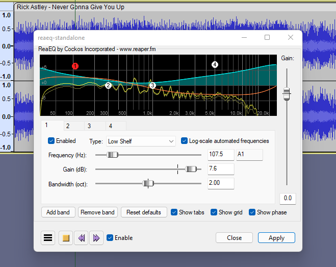

# Equalizers

## MuseFX Simple EQ

An easy to use yet powerful EQ. Part of the [#muse-fx](plugin-suites.md#muse-fx "mention") pack.

Details

See the pack for installation instructions.

## MuseFX ProEQ

An easy to use 4-band EQ. Part of the [#muse-fx](plugin-suites.md#muse-fx "mention") pack.

Details

See the pack for installation instructions.

## ReaEQ

An unlimited band IIR based equalizer effect, part of ReaPlugs.


Download page


Details

Copyright (C) 2006-2016, Cockos Incorporated VST PlugIn Technology by Steinberg Media Technologies GmbH

Information From the vendor:

* Unlimited band IIR based equalizer
* Support for any number of many types of filters (shelfs, bands, LPF, HPF, notch, bandpass, allpass)
* Frequency response and phase response display
* Display of approximate note+octave for frequencies
* Per-band bypass control
* Full-view of graph optional for precise editing
* Mouse modifiers/mousewheel usable for editing bandwidth of points in graph

## Voxengo Marvel GEQ

A 16-band linear-phase graphic equalizer with multi-channel operation support


Download page


Details

Information from the vendor

* 16-band graphic equalizing
* Freehand drawing mode
* Linear-phase equalizing
* \+/- 12 dB gain range per band
* Stereo and multi-channel processing
* Internal channel routing
* Channel grouping
* Mid/side processing
* 64-bit floating point processing
* Preset manager
* Undo/redo history
* A/B comparisons

## Red Rock Sound EQ302

A 32-band equalizer offering -12 dB to +12 dB gain in 1/3 octave steps from 16 Hz to 20 kHz


Download page


Details

Information from the vendor

* 32-band graphic equalizer
* Selectable -12 to +12 dB or -6 to +6 dB gain
* Integrated low-cut filter
* Adjustable input gain

## Red Rock Sound EQ560

A 10-band graphic equalizer emulating the 1967 EQ560 hardware


Download page


Details

Copyright © 2012–2022 Red Rock Sound

Information from the vendor

* 10 bands of proprietary equalization.
* Familiar graphics operation on one octave centers.
* 12 dB of boost/cut per band.
* Proportional Q narrows filter Q at extremes.
* IN/OUT switch — allows the user to bypass the Graphic Eq for before/after comparisons.

## MEqualizer

6-band equalizer with analyzer, part of the [#mfreefxbundle](plugin-suites.md#mfreefxbundle "mention") pack

Details

**MConvolutionEZ** is an extremely easy-to-use and powerful 6-band equalizer. It also provides an advanced visualization including a spectrum analyzer and sonogram.

* Advanced GUI
* Compare multiple settings: A to H Switching and A to D Morphing
* 9 filter types for each band with quick adjustment
* Powerful spectrum analyzer and sonogram
* Unique visualisation engine with classic meters and time graphs
* MIDI controllers with MIDI learn
* M/S, single channel, up to 8 channelds surround and up to 64 channels ambisonics processing
* Extremely fast, optimized for newest AVX2 and AVX512 capable processors
* Supports VST, VST3, AU and AAX interfaces on Windows and macOS

See the [pack ](plugin-suites.md#mfreefxbundle)for installation instructions.

## See also

* Nyquist [filters-and-eq.md](../nyquist-plugins/effect-plugins/filters-and-eq.md "mention") effects
