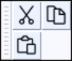

# Missing features

## Audacity Wiki

The Audacity Wiki has been shut down.

You may find the information you were looking for in the following places:

<table data-view="cards"><thead><tr><th></th><th></th><th></th><th data-hidden data-card-target data-type="content-ref"></th></tr></thead><tbody><tr><td><strong>Plugin downloads</strong></td><td>Includes <a href="https://plugins.audacityteam.org/nyquist-plugins/generator-plugins">Generator</a> and <a href="https://plugins.audacityteam.org/nyquist-plugins/effect-plugins">Effect plugins</a> and the <a href="https://plugins.audacityteam.org/analyzers/analysis-plugins#acx-check">ACX check</a></td><td></td><td><a href="http://localhost:5000/o/-MhmG2mhIIHTtQPuHV_k/s/klCVENFte0GRy5IqVz0W/">Audacity Plugins</a></td></tr><tr><td><strong>Developer info</strong></td><td>Bug tracker and code can be found on <a href="https://github.com/audacity/audacity">Github</a></td><td></td><td><a href="http://localhost:5000/o/-MhmG2mhIIHTtQPuHV_k/s/9ZM0AACxI0iUTeAM2egf/">Audacity Dev</a></td></tr><tr><td><strong>Contributor info</strong></td><td>Information for translators, testers, tutorial makers, forum helpers</td><td></td><td><a href="../community/contributing/">contributing</a></td></tr><tr><td><strong>Changelogs</strong></td><td>and Release Notes</td><td></td><td><a href="../additional-resources/changelog/">changelog</a></td></tr><tr><td><strong>Help &#x26; Support</strong></td><td><a href="../">Tutorials</a> and the <a href="https://manual.audacityteam.org/">manual</a></td><td></td><td><a href="../">..</a></td></tr><tr><td><strong>Audio technology</strong></td><td>on the Hydrogenaudio wiki (external site)</td><td></td><td><a href="https://wiki.hydrogenaud.io/index.php?title=Main_Page">https://wiki.hydrogenaud.io/index.php?title=Main_Page</a></td></tr></tbody></table>

A wikidump of the Audacity Wiki as of March 31, 2023 can be found [in the Internet Archive](https://archive.org/details/audacity-wiki). It can be accessed and worked with in the same way as [Wikipedia's dumps](https://meta.wikimedia.org/wiki/Data\_dumps).&#x20;

## Device preferences

In Audacity version 3.3.0, the Device preference page has been renamed to **Audio Settings**.

## Project Rate

In Audacity version 3.3.0, the Project Rate has been renamed to **Project Sample Rate** and moved into the **Audio Setup button** -> **Audio Settings.**

## Cut, Copy and Paste buttons

The **Cut**, **Copy** and **Paste** buttons have been removed from the **Edit Toolbar** in version 3.2.0.

Audacity version 3.2.3 introduced the **Cut/Copy/Paste Toolbar** which is disabled by default.  Check **View > Toolbars > Cut/Copy/Paste Toolbar** to enable it.

<figure><figcaption>
Cut/Copy/Paste Toolbar
</figcaption></figure>

You can also access the Cut/Copy/Paste functionality in the following ways instead:

* **Right-click** the selected audio and choose Cut/Copy/Paste
* In the **Edit menu**, choose Cut/Copy/Paste
* Use **shortcuts**:&#x20;
  * `Ctrl+X` is cut (`Cmd+X` on macOS)
  * `Ctrl+C` is copy (`Cmd+C` on macOS)
  * `Ctrl+V` is paste (`Cmd+V` on macOS)

## Device Toolbar

<figure><figcaption>
Look of the Device Toolbar
</figcaption></figure>

The Device toolbar has been replaced by the Audio Setup button in version 3.2.0. However, you can re-enable it via **View -> Toolbars -> Device Toolbar.**

## Zoom Tool

The Zoom Tool has been removed in version 3.2.0. All of it's functionality can be accessed via the Zoom buttons, or via **`Ctrl+Scroll`** (`Cmd+Scroll`)

## Time Shift Tool

Audacity's Time Shift Tool has been removed in version 3.1.0. It got replaced by drag handles at the top of every clip. You now can time-shift audio without having to switch into a special mode.&#x20;
