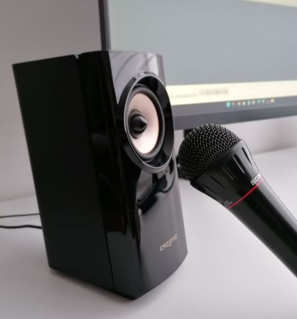

# Latency Compensation


This video explains how to compensate latency in Audacity



**Note:** Latency Compensation is only important for the following recording scenarios:

* **Overdubbing**: recording a new audio track while listening to previously-recorded track(s).  You want what you play to be synchronized with the tracks you are listening to.
* **Punch and roll recording**


## Measuring latency in your system


There is an automated method available now, which is available at [https://forum.audacityteam.org/t/latency-test/65001](https://forum.audacityteam.org/t/latency-test/65001)

It's currently in beta, so please leave your feedback in the forum thread


### Step 1: Adjust your Audacity preferences

#### 1. Set your Devices Preferences

* On Windows open the **Edit** menu and select **Preferences...** or press **`Ctrl + P`** in your keyboard. On macOS open the **Audacity** menu and select **Preferences...** or press **Cmd + P**
* Select **Devices** in the left pane of the **Preferences** window
* Select the preferred **Interface Host:** MME or Windows WASAPI should work
* Verify your preferred **Playback Device** is selected
* Verify your preferred **Recording Device** is selected
* Set the **Latency compensation** to 0 (zero) milliseconds
* Click **OK** to save your preferences

#### 2. Set your Recording Preferences

* Select **Recording** in the left pane of the **Preferences** window
* Enable **Overdub**: Check **Play other tracks while recording (overdub)**
* Make sure **Software playthrough of input** is not checked
* Click **OK** to save your preferences

#### 3. Set your Selection preferences

At the bottom of the Audacity window you will find the **Selection** toolbar

* Disable snapping, if you have it enabled
* Select **Start and Length of Selection** as your selection format

### Step 2: Measuring the latency

#### Hardware Setup

To measure the latency you will need to record the audio from your playback device using your microphone.  To do this place your microphone next to your speakers/headphones

#### Recording while playing a test track (Overdub)

* Open the **Generate** menu and select the **Rhythm Track...** option.  Set **Number of Measures (bars)** to 2 and set the **Beat Sound** to **Ping (short)**.  Click **OK** to generate the track.
* Press **Shift + R** to record a new track. The rhythm track will be played back and recorded on a new track.

* Zoom in so you can see the clicks on the top track and its delayed version on the bottom track
* Create a selection that goes from the start of one click to the next

You should see something like this:

You can read the latency directly from the second panel of numbers. In this case it is 0.184 seconds or 184 milliseconds.

Click on **Edit > Preferences**, click on **Devices** tab and enter the negative of this number in the **Latency compensation** box. In this case it would be -184.  Press **OK** to save your preferences.

### Step 3: Checking the result

* Delete the second track by clicking the close box in its Track Control Panel
* Click in the Track Control Panel of the remaining track to select it
* Press **Shift + R** to record a new track

After the recording is finished Audacity will apply the Latency compensation by pushing the newly-recorded track back by the Latency compensation value.


**Note:** If you change any of your recording or playback devices (for example, if you change from using the line input port on your computer to using a USB audio interface) or if you use the same device but change the [Audio Host](https://manual.audacityteam.org/man/device\_toolbar.html#host) in [Device Toolbar](https://manual.audacityteam.org/man/device\_toolbar.html), then you will need to do this test again. The test you just did only applies for the specific inputs and outputs and host used during the test.

